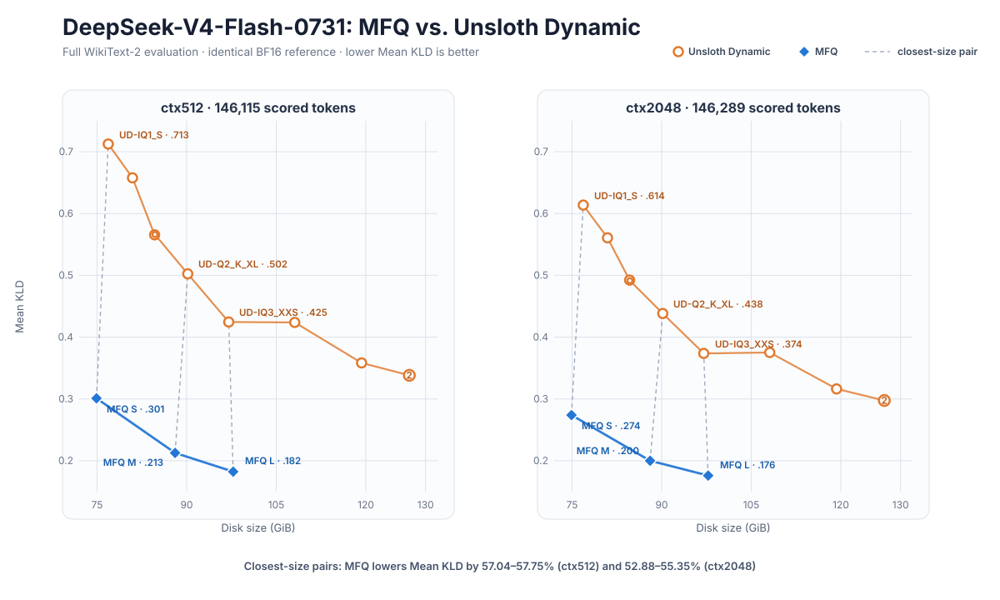
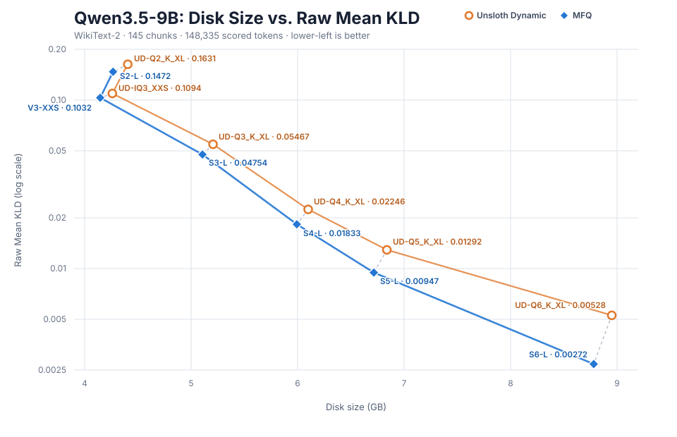
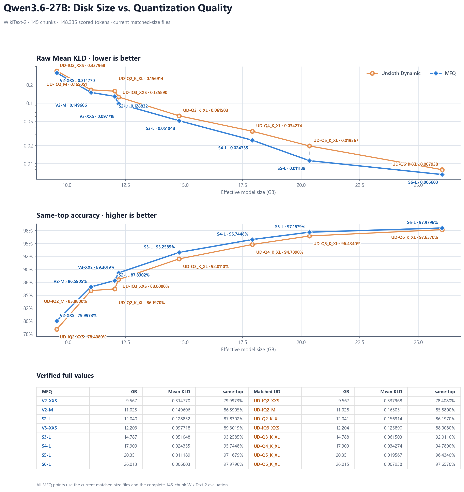
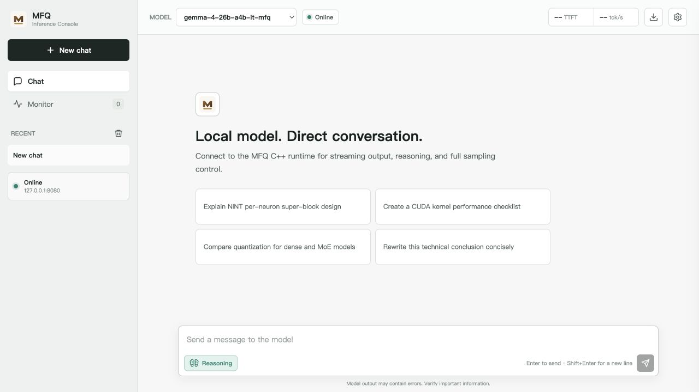

<div align="center">

# TyloQuant MFQ


**Neuron-anchored mixed-format quantization and high-fidelity LLM inference**

**Every Bit. Maximum Fidelity.**

**Carry more intelligence in fewer bits, enabling frontier models to run efficiently across hardware and on every device.**

NINT · NVQ/NPQ · NEPQ · TPQ · Expert-Wise MoE · CUDA/C++ Runtime

</div>

<p align="center">
  <strong>English</strong> | <a href="./README.zh-CN.md">中文</a>
</p>

<p align="center">
  <a href="https://huggingface.co/Tylogi">Hugging Face Models</a> · <a href="https://www.modelscope.cn/profile/Tylogi">ModelScope Models</a>
</p>

## Result at a Glance

### DeepSeek-V4-Flash-0731



The official-0731 WikiText-2 evaluation covers 573 chunks and 146,115 scored
tokens at `ctx=512`. The released 77.519 GiB S tier records `0.313576` Mean
KLD and `82.2913%` same-top. The 88.007 GiB M and 98.007 GiB L tiers record
`0.244488` / `84.5300%` and `0.201444` / `86.0753%`, respectively. Across the
three nearest-size UD comparisons, MFQ reduces Mean KLD by **34.24–51.42%**.

### Qwen3.5-9B: disk size vs. Mean KLD



The full WikiText-2 evaluation uses 145 chunks and 148,335 scored tokens
against the same BF16 reference. MFQ improves raw Mean KLD at every matched
precision tier shown above.

### Qwen3.6-27B: disk size vs. quality



The aligned `ubatch=2048` evaluation compares current, matched-size MFQ files
with their Unsloth Dynamic recipes. Lower Mean KLD and higher same-top are
better. All plotted tiers use the complete 145-chunk evaluation of the current
file.

## Overview

**TyloQuant MFQ** (or **MFQ**) co-designs quantization formats, precision
allocation, and inference kernels for high-fidelity LLM deployment. It supports
custom weight encodings from `0.84-8.30 bpw`, allocates precision per compute
group or MoE expert, and executes packed weights directly through CUDA kernels
and a C++ runtime.

Public MFQ models use a unified `V`/`S` naming scheme: vector-quantized models
matched to llama.cpp `IQ*` use `V`, while scalar-quantized models matched to
`Q*_K*` use `S`. For example, `IQ3_XXS → V3-XXS` and
`Q4_K_XL → S4-L`.

## Installation

### Requirements

- Python `>=3.10`
- Git
- [uv](https://docs.astral.sh/uv/)
- CMake and a native C++ toolchain
- Node.js and npm for the browser Web UI
- NVIDIA GPU and CUDA toolkit for CUDA acceleration on Windows or Linux
- Apple silicon for Metal acceleration on macOS

### Install from source

`mfq` is the only public CLI. Use the same commands in Windows PowerShell,
macOS Terminal, or a Linux shell:

```shell
git clone https://github.com/mfq/mfq.git MFQ
cd MFQ
# CUDA (Windows or Linux)
uv sync --extra train --extra calibration --extra daemon

# Metal (Apple silicon)
uv sync --extra train --extra calibration --extra daemon --extra metal
uv run mfq build
```

`mfq build` detects the host OS and accelerator. To customize CMake
configuration, put extra arguments after `--`:

```shell
uv run mfq build -- -DCMAKE_CUDA_ARCHITECTURES=90
```

After a successful build, `mfq` records the actual artifact and build recipe in
its managed manifest. `mfq serve` therefore finds builds made with a custom
`--build-dir` automatically and can recreate a missing artifact with the same
configuration.

Verify the installation:

```shell
uv run mfq --help
uv run mfq quantize --help
```

### Quantization

`mfq quantize` is the stable quantization entry point. It auto-detects an HF
safetensors directory, a full-precision MFQ, or a full-precision GGUF and calls
the existing production converter directly:

`mfq calibrate` creates calibration artifacts, including reusable importance
matrices for `mfq quantize --imatrix`.

```shell
# Copy HF native storage exactly into a full-precision MFQ. BF16 stays BF16;
# block FP8/MXFP4 values and their E8M0 scales remain self-contained and exact.
# This command performs no MFQ quantization.
uv run mfq quantize model-hf model-full.mfq --full-precision

# Quantize that full-precision MFQ through the same NINT/VQ/NPQ/NEPQ/TPQ path.
uv run mfq quantize model-full.mfq model-NINT3.mfq \
  --bits 3 --groupsize 24 --sub-bits 5 --backend cpu --device cpu

# Mixed recipe from a BF16 GGUF source
uv run mfq quantize model-bf16.gguf model-S4-L.mfq \
  --recipe UD-Q4_K_XL.gguf --imatrix imatrix.gguf \
  --q8-mode nint8-0 --device cuda

# HF source with an expert-wise precision scheme
uv run mfq quantize model-hf model-EW.mfq \
  --recipe UD-Q4_K_XL.gguf --ew-scheme expert-precision.json

# Collect a reusable activation imatrix from the prepared corpus. CUDA uses
# FP64 accumulation by default; Apple silicon uses BF16 forward + FP32 Metal
# accumulation. The output is accepted directly by `mfq quantize --imatrix`.
uv run mfq calibrate imatrix \
  --model model-hf --corpus calibration-corpus \
  --output calibration.imatrix --backend cuda

uv run mfq calibrate imatrix \
  --model model-hf --corpus calibration-corpus \
  --output calibration.imatrix --backend metal

# Important Neurons (IN); layer count is read from the recipe when possible
uv run mfq quantize model-bf16.gguf model-IN.mfq \
  --recipe UD-Q4_K_XL.gguf --imatrix imatrix.gguf \
  --important-neurons 1024 --target-size 15G
```

## Web UI

`mfq serve` builds or updates the runtime when needed, loads the model, and
starts the API and Web UI. It is the only server entry point; the native C++
worker stays private and is managed by the CLI:

```shell
uv run mfq serve --model path/to/model.mfq --host 127.0.0.1 --port 8090
```

`--host` and `--port` control the public API listener and default to
`127.0.0.1:8090`. Open the Web UI address printed by the command.



## How It Works

| Layer | Design | Purpose |
|---|---|---|
| Weight formats | NINT, NVQ, NPQ, NEPQ, TPQ | Quality tiers from 8 bit to below 1 bit |
| Dense allocation | Importance-aware allocation | Select precision per compute group |
| MoE allocation | Expert-Wise Precision | Spend bitrate on experts with higher expected output contribution |
| Expert container | NINTM v2 | Store heterogeneous formats in one MoE tensor |
| Runtime assets | Reserved `BLOB` records | Keep config, tokenizer, chat template, and special-token metadata in the MFQ file |
| Inference | CUDA kernels + C++ runtime | Execute packed weights without materializing full FP16 weights |

NINT shares high-level affine metadata along an output-neuron row and spends
the saved budget on shorter local groups. Below 4 bit, NVQ, NPQ, and NEPQ use
short vector codes and expert-aware codebook sharing. The allocator then chooses
formats under a real byte budget, while NINTM groups compatible experts for
direct packed execution.

## Current Scope

- Qwen3.5 full attention and linear attention/GDN
- Qwen3.6 routed MoE
- Gemma4 GeGLU, sliding-window attention, and routed MoE
- DeepSeek-V4-Flash HCA/CSA/mHC and MoE
- MiniCPM-o 4.5 official composite Python graph with MFQ-backed CUDA matrix modules
- NINTM v2 mixed-family HF/GGUF streaming conversion
- Self-contained MFQ files with embedded runtime config and GGUF tokenizer metadata
- Numbered MFQ shards with direct quantizer output and transparent Python/C++ loading
- OpenAI-compatible chat/completions API with SSE

The current CUDA inference implementation remains a single-GPU research
prototype. Apple
silicon now has packed NINT/NVQ/NPQ/NEPQ group-vectorized GEMV, qmv_wide
small-M MMQ, online-decode `simdgroup_matrix` GEMM, and CUDA-style temporary
dequantize plus MLX GEMM at the measured large-M crossover. Compatible
NINT/VQ-family gate/up projections fuse SwiGLU. MHA/GQA/MQA, dynamic and
sliding-window KV caches, single-dispatch heterogeneous NINTM/NEPQ routing,
fused SSM/GDN kernels, GLM DSA/sparse MLA, DeepSeek-V4 compression/indexer/
sparse-attention/HC kernels, and a Qwen3.5 full/linear hybrid CausalLM
prefill/decode/generation runtime are available. Ordinary mixed-format QKV and
FFN projection groups execute in one heterogeneous Metal dispatch.
TPQ-I4G64, TPQ-X/W/V/VV, and three-projection TPQ-P kernels with p8-p16
indices plus the Kimi-K3 KDA/MLA,
Attention-Residual,
SiTU MoE, cache, and generation graph are also wired. DeepSeek-V4 now has
native MFQ loading, compressed/local/indexer caches, mmap-backed bounded expert
residency, prefill, decode, and generation. Gemma4 now has self-contained
sharded-MFQ loading, mixed full/sliding attention, fused norm/GeGLU/MoE,
cache, and generation. GLM-MoE-DSA has native loading, shared indexer state,
dense/sparse MLA, cache, and generation. Greedy, softmax, top-k/top-p, and
sampling-penalty kernels remain GPU-resident.

## Documentation

- [MiniCPM-o 4.5 Python Runtime](./docs/minicpmo45.md)
- [Expert-Wise Joint Budget Solver](./docs/ew-joint-solver.md)

## Acknowledgements

MFQ benefits from the outstanding work of the open-source AI community. We
especially thank:

- [llama.cpp](https://github.com/ggml-org/llama.cpp) for the GGUF ecosystem,
  optimized inference backends, and evaluation tooling that underpin important
  parts of MFQ interoperability and validation.
- [oMLX](https://github.com/jundot/omlx) for its excellent Apple silicon
  inference engineering and valuable performance and design references.
- [MLX](https://github.com/ml-explore/mlx) for the Apple silicon array framework
  and Metal runtime used by MFQ's native macOS path.
- [PyTorch](https://github.com/pytorch/pytorch) and
  [Transformers](https://github.com/huggingface/transformers) for core research,
  model integration, and quantization infrastructure.
- [Unsloth](https://github.com/unslothai/unsloth) for openly released Dynamic
  quantization models and reproducible comparison baselines.

We are grateful to their maintainers and contributors for making
high-performance local inference more accessible.

License: [Apache License 2.0](./LICENSE).
