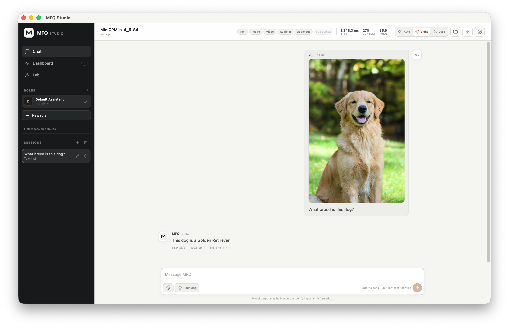

<div align="center">

# TyloQuant MFQ


**Neuron-anchored mixed-format quantization and high-fidelity LLM inference**

**Every Bit. Maximum Fidelity.**

NINT · NVQ/NPQ · NEPQ · TPQ · Expert-Wise MoE · CUDA · Metal · C++ Runtime

</div>

<p align="center">
  <strong>English</strong> | <a href="./README.zh-CN.md">中文</a>
</p>

<p align="center">
  <a href="https://huggingface.co/Tylogi">Hugging Face Models</a> · <a href="https://www.modelscope.cn/profile/Tylogi">ModelScope Models</a>
</p>

## Overview

**TyloQuant MFQ** (or **MFQ**) co-designs quantization formats, precision
allocation, and inference kernels for high-fidelity LLM deployment. It supports
custom weight encodings from `0.84-8.30 bpw`, allocates precision per compute
group or MoE expert, and executes packed weights directly through native CUDA
and Metal paths backed by a C++ runtime.

Public MFQ models use a unified `V`/`S` naming scheme: vector-quantized models
matched to llama.cpp `IQ*` use `V`, while scalar-quantized models matched to
`Q*_K*` use `S`. For example, `IQ3_XXS → V3-XXS` and
`Q4_K_XL → S4-L`.

## Installation

### Requirements

#### Common

- Git
- [uv](https://docs.astral.sh/uv/)
- CMake `>=3.26` and a native C++ toolchain

#### Inference backend (choose one)

- **CUDA:** Linux or Windows, an NVIDIA GPU, and CUDA Toolkit `>=12` with
  `nvcc`, cuBLAS, and the CUDA runtime.
- **Metal:** Apple silicon and macOS; the `metal` extra supplies MLX and its
  native runtime assets.

#### Optional

- Node.js and npm are needed only when MFQ builds the browser Web UI from
  source. Without them, `mfq serve` can still expose the API.

`uv` automatically provisions the Python `>=3.10` runtime required by MFQ when
needed; no separate Python installation is required.

### Install from source

Use `mfq` for all CLI commands. In PowerShell, put multi-line commands on one
line or replace each trailing `\` with a backtick.

```shell
git clone https://github.com/Tylogi/TyloQuant.git MFQ
cd MFQ
```

#### CUDA (Windows or Linux)

Native CUDA inference does not require PyTorch or LibTorch.

```shell
uv sync --extra daemon
uv run mfq build --backend cuda
```

#### Metal (Apple silicon)

```shell
uv sync --extra daemon --extra metal
uv run mfq build --backend metal
```

Add the offline workflow extras on machines that need them:

```shell
# CUDA
uv sync --extra daemon --extra train --extra calibration

# Apple silicon
uv sync --extra daemon --extra metal --extra train --extra calibration
```

`mfq build` detects the host OS and accelerator. To customize CMake
configuration, put extra arguments after `--`:

```shell
uv run mfq build -- -DCMAKE_CUDA_ARCHITECTURES=90
```

`mfq build` records the executable and CMake options in
`build/mfq-runtime.json`. `mfq serve` reuses that build, including a custom
`--build-dir`, and rebuilds it if the executable is missing.

Verify the installation:

```shell
uv run mfq --help
uv run mfq build --help
```

## Quick Start

Start an empty server:

```shell
uv run mfq serve
```

Open <http://127.0.0.1:8090/>. Check the API from another terminal:

```shell
curl http://127.0.0.1:8090/health
```

Download an MFQ file from [Hugging Face](https://huggingface.co/Tylogi) or
[ModelScope](https://www.modelscope.cn/profile/Tylogi). Load it from the Studio
model catalog, or restart the server with the model path:

```shell
uv run mfq serve --model /absolute/path/to/model.mfq
```

Open the Web UI after the model status changes to `ready`. The
[`mfq serve` reference](./docs/cli/serve.md) covers model directories,
authentication, and API access.

## Quantization

`mfq quantize` accepts an HF safetensors directory, a full-precision MFQ, or a
full-precision GGUF. In a quantization-only checkout, install the `train`
extra:

```shell
uv sync --extra train
```

Quantize an HF checkpoint to uniform NINT4:

```shell
uv run mfq quantize model-hf model-NINT4.mfq \
  --bits 4 --groupsize 24 --sub-bits 6 --backend auto
```

Copy the source checkpoint into a full-precision MFQ without quantizing it:

```shell
uv run mfq quantize model-hf model-full.mfq --full-precision
```

[`mfq quantize`](./docs/cli/quantize.md) covers mixed GGUF recipes,
Expert-Wise overrides, MTP augmentation, Important Neurons, sharding, and
restart controls. [`mfq calibrate`](./docs/cli/calibrate.md) covers activation
imatrices and calibration.

## Web UI

`mfq serve` runs the public API and Web UI and manages the private C++ worker.
It can start empty or load a model at startup:

```shell
uv run mfq serve
uv run mfq serve --model path/to/model.mfq --host 127.0.0.1 --port 8090
uv run mfq serve --model-dir path/to/models --host 127.0.0.1 --port 8090
```

`--host` and `--port` control the public API listener and default to
`127.0.0.1:8090`. Open the Web UI address printed by the command.

The desktop Studio **Models and jobs** page loads any local `.mfq` file without
copying it. Selecting one shard loads the full sibling shard family.



## Results

### DeepSeek-V4-Flash-0731


**Evaluation:** Official 0731 weights on WikiText-2, covering 573 chunks and
146,115 scored tokens at `ctx=512`.

| Released tier |       Size |  Mean KLD ↓ |  Same-top ↑ |
| ------------- | ---------: | -----------: | -----------: |
| S             | 77.519 GiB | `0.313576` | `82.2913%` |
| M             | 88.007 GiB | `0.244488` | `84.5300%` |
| L             | 98.007 GiB | `0.201444` | `86.0753%` |

**Nearest-size comparison:** Against the three closest-size Unsloth Dynamic
(UD) baselines, MFQ reduces Mean KLD by **34.24–51.42%**.

### Qwen3.5-9B: disk size vs. Mean KLD


- **Evaluation:** Full WikiText-2 run with 145 chunks and 148,335 scored tokens;
  all tiers use the same BF16 reference.
- **Result:** MFQ achieves lower raw Mean KLD at every matched precision tier
  shown above.

### Qwen3.6-27B: disk size vs. quality


- **Evaluation:** Complete 145-chunk runs aligned at `ubatch=2048`; every
  plotted tier uses all chunks.
- **Comparison:** Each MFQ file is paired with the corresponding matched-size
  Unsloth Dynamic recipe.
- **Metrics:** Lower Mean KLD and higher same-top accuracy are better.

## How It Works

| Layer            | Design                           | Purpose                                                                           |
| ---------------- | -------------------------------- | --------------------------------------------------------------------------------- |
| Weight formats   | NINT, NVQ, NPQ, NEPQ, TPQ        | Quality tiers from 8 bit to below 1 bit                                           |
| Dense allocation | Importance-aware allocation      | Select precision per compute group                                                |
| MoE allocation   | Expert-Wise Precision            | Spend bitrate on experts with higher expected output contribution                 |
| Expert container | NINTM v2                         | Store heterogeneous formats in one MoE tensor                                     |
| Runtime assets   | Reserved `BLOB` records          | Keep config, tokenizer, chat template, and special-token metadata in the MFQ file |
| Inference        | CUDA/Metal kernels + C++ runtime | Execute packed weights without materializing full FP16 weights                    |

NINT shares affine metadata across each output row, leaving more space for
short local groups. Below 4 bit, NVQ, NPQ, and NEPQ use short vector codes and
expert-aware codebook sharing. The allocator works from serialized byte size,
and NINTM groups compatible experts for packed execution.

## Current Scope

> [!NOTE]
> Runtime support is experimental. CUDA uses one GPU by default.

- `End-to-end`: native MFQ loading, prefill, decode, and generation.
- `Partial`: architecture-specific components without a complete public model
  runtime.
- `Dedicated`: a separate TPQ/MFQ execution path.

| Model or family   | Conversion and packaging           | CUDA inference | Metal inference | Scope or current limitation                         |
| ----------------- | ---------------------------------- | -------------- | --------------- | --------------------------------------------------- |
| Qwen3.5           | HF/GGUF/full-precision MFQ         | End-to-end     | End-to-end      | Full/linear hybrid CausalLM                         |
| Qwen3.6           | HF/GGUF/full-precision MFQ         | Partial        | Partial         | Routed-MoE components; no public end-to-end runtime |
| Gemma4            | HF/GGUF and sharded MFQ            | End-to-end     | End-to-end      | Mixed full/sliding attention                        |
| DeepSeek-V4-Flash | HF/GGUF, Expert-Wise MFQ, and TPQ  | End-to-end     | End-to-end      | Compression, indexer, and sparse-attention paths    |
| MiniCPM-o 4.5     | Official composite HF graph to MFQ | End-to-end     | End-to-end      | Official model directory required at runtime        |
| GLM-MoE-DSA       | Native MFQ and mixed precision     | End-to-end     | End-to-end      | Dense/sparse MLA paths                              |
| Kimi-K3           | TPQ/MFQ packaging                  | Dedicated      | Dedicated       | TPQ/MFQ execution path only                         |

Shared features:

- NINTM v2 streaming conversion;
- self-contained and sharded MFQ files;
- Python/C++ loading;
- OpenAI-compatible APIs with SSE.

Kernel and model details: [runtime support matrix](./docs/runtime-support.md).

## Documentation

### CLI and serving

- [`mfq build`](./docs/cli/build.md)
- [`mfq quantize`](./docs/cli/quantize.md)
- [`mfq calibrate`](./docs/cli/calibrate.md)
- [`mfq serve` and model management](./docs/cli/serve.md)
- [HTTP API](./docs/api/http.md)
- [WebSocket API](./docs/api/websocket.md)

### Runtime and validation

- [Runtime support matrix](./docs/runtime-support.md)
- [Runtime sampling profiles](./docs/runtime-sampling-profiles.md)
- [Native CUDA runtime validation](./docs/cuda-native-runtime-validation.md)

### Quantization and model integrations

- [Expert-Wise Joint Budget Solver](./docs/ew-joint-solver.md)
- [MiniCPM-o 4.5 Runtime](./docs/minicpmo45.md)
- [Self-contained releases](./docs/release.md)

## Acknowledgements

MFQ builds on:

- [llama.cpp](https://github.com/ggml-org/llama.cpp): GGUF interoperability,
  inference backends, and evaluation tools.
- [oMLX](https://github.com/jundot/omlx): Apple silicon performance and runtime
  design references.
- [MLX](https://github.com/ml-explore/mlx): the array framework and Metal
  runtime used by the macOS path.
- [PyTorch](https://github.com/pytorch/pytorch) and
  [Transformers](https://github.com/huggingface/transformers): model integration
  and quantization infrastructure.
- [Unsloth](https://github.com/unslothai/unsloth): Dynamic quantization models
  used as comparison baselines.

License: [Apache License 2.0](./LICENSE).
