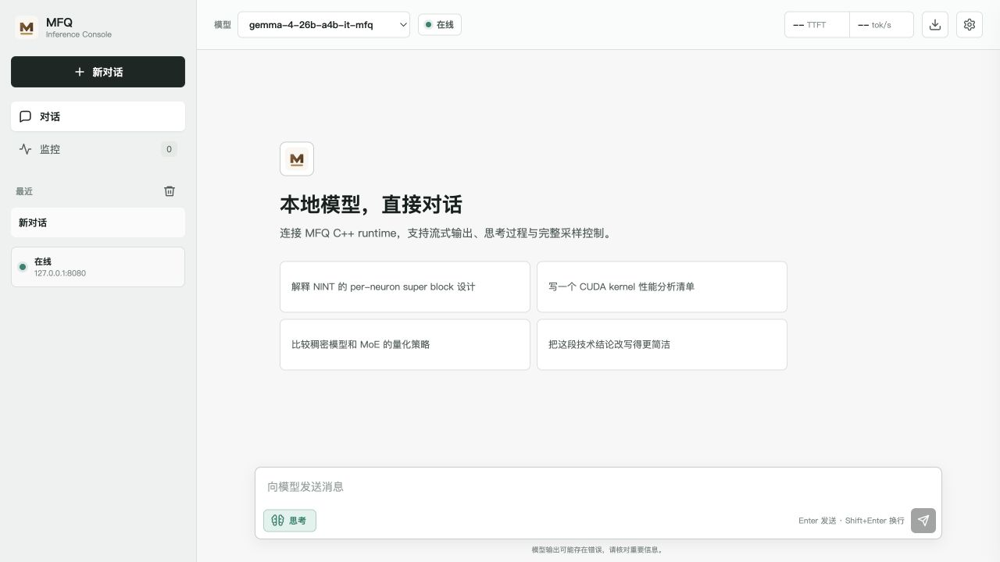

<div align="center">

# TyloQuant MFQ


**Neuron-anchored mixed-format quantization and high-fidelity LLM inference**

**Every Bit. Maximum Fidelity.**

NINT · NVQ/NPQ · NEPQ · Gradient Precision Calibration · Expert-Wise MoE · CUDA/C++ Runtime

</div>

<p align="center">
  <a href="./README.md">English</a> | <strong>中文</strong>
</p>

**TyloQuant MFQ**（简称 **MFQ**）联合设计量化格式、精度分配与推理 kernel，面向高保真
LLM 部署。项目支持 `0.84-8.30 bpw` 的自定义权重编码，可按计算组或 MoE 专家分配精度，
并由 CUDA kernel 与 C++ runtime 直接执行 packed 权重。

## 核心结果

### Qwen3.5-9B：文件大小与 Mean KLD


完整 WikiText-2 评测包含 145 个 chunk、148,335 个计分 token，并使用同一
BF16 参考模型。上图所示的每个匹配精度档位中，MFQ 的原始 Mean KLD 均更低。

### DeepSeek-V4-Flash-0731


完整 WikiText-2 评测在两套 runtime 中使用相同的 BF16 reference logits、tokenizer、
BOS 与 token 序列；`ctx512` 覆盖 146,115 个计分 token，`ctx2048` 覆盖 146,289 个。
三组最接近体积的对位中，MFQ 在 `ctx512` 下将 Mean KLD 降低
**57.04–57.75%**，在 `ctx2048` 下降低 **52.88–55.35%**，且每组文件大小差均不超过
2.116 GiB。Mean KLD 越低越好。完整数据与测试协议见
[DeepSeek-V4-Flash-0731 实验结果](./docs/deepseek-v4-flash-0731-results.md)。

## 安装

### 环境要求

- Python `>=3.10`
- Git
- CUDA 推理需要 NVIDIA GPU 与 CUDA Toolkit
- 构建原生 runtime 需要 CMake、Ninja 与 C++ 工具链

### 从源码安装

```powershell
git clone REPOSITORY_URL MFQ
cd MFQ
python -m venv .venv
```

激活虚拟环境：

```powershell
# Windows PowerShell
.\.venv\Scripts\Activate.ps1
```

```bash
# Linux
source .venv/bin/activate
```

安装量化与校准工具链：

```bash
python -m pip install --upgrade pip
python -m pip install -e ".[train,calibration]"
```

验证安装：

```bash
mfq --help
mfq quantize --help
```

### 量化

`mfq quantize` 是稳定的统一量化入口。它会自动识别 HF safetensors 目录、
满精度 MFQ 或满精度 GGUF，并直接调用现有生产量化器：

```bash
# 把 HF 原生存储逐字节写入满精度 MFQ：BF16 仍是 BF16，
# block FP8/MXFP4 及其 E8M0 scale 自包含保留。这一步不做 MFQ 量化。
mfq quantize model-hf model-full.mfq --full-precision

# 满精度 MFQ 再复用同一套 NINT/VQ/NPQ/NEPQ/TPQ 量化路径
mfq quantize model-full.mfq model-NINT3.mfq \
  --bits 3 --groupsize 24 --sub-bits 5 --backend cpu --device cpu

# BF16 GGUF，按混合精度 recipe 量化
mfq quantize model-bf16.gguf model-S4-L.mfq \
  --recipe UD-Q4_K_XL.gguf --imatrix imatrix.gguf \
  --q8-mode nint8-0 --device cuda

# HF 权重，叠加逐专家精度方案（EW）
mfq quantize model-hf model-EW.mfq \
  --recipe UD-Q4_K_XL.gguf --ew-scheme expert-precision.json

# Important Neurons（IN）；可从 recipe 自动读取层数
mfq quantize model-bf16.gguf model-IN.mfq \
  --recipe UD-Q4_K_XL.gguf --imatrix imatrix.gguf \
  --important-neurons 1024 --target-size 15G
```

原有 `python -m mfq.tools.quantize_*` 高级入口继续保留，用于量化算法实验。
统一入口只暴露模型级输入、精度产物、分片与恢复参数。

### 构建 C++ Runtime

在 Visual Studio x64 Developer PowerShell 中运行：

```powershell
cmake -S cpp_runtime -B build/cpp_runtime -G Ninja -DCMAKE_BUILD_TYPE=Release
cmake --build build/cpp_runtime -j 8
```

原生 runtime 链接启用 CUDA 的 llama.cpp 构建。`MFQ_LLAMA_BUILD_DIR`、服务启动、WebUI
和 OpenAI 兼容 API 的使用方法见 [C++ runtime 指南](./cpp_runtime/README.md)。

## WebUI

C++ runtime 内置本地 WebUI，启动服务后可访问
[`http://127.0.0.1:8080/admin/`](http://127.0.0.1:8080/admin/)。界面支持流式对话、
思考过程展示、采样参数控制、对话历史、连接状态和运行监控。



## 工作原理

| 层次 | 设计 | 作用 |
|---|---|---|
| 权重格式 | NINT、NVQ、NPQ、NEPQ | 提供从 8 bit 到低于 1 bit 的质量档 |
| Dense 分配 | 梯度精度校准 | 按计算组选择精度 |
| MoE 分配 | Expert-Wise Precision | 将码率集中到期望输出贡献更高的专家 |
| 专家容器 | NINTM v2 | 在同一 MoE tensor 中保存异构格式 |
| 推理系统 | CUDA kernel + C++ runtime | 不展开完整 FP16 权重，直接执行 packed 权重 |

NINT 沿输出神经元权重行共享顶层仿射元数据，并把节省的预算用于更短的局部 group。
低于 4 bit 时，NVQ、NPQ 与 NEPQ 使用短向量编码和专家感知的码本共享。分配器依据真实
字节预算选择格式，NINTM 再将兼容专家分组并直接执行 packed 权重。

全部 16 种正式编码见[量化格式规范](./FORMATS.md)。

## 当前支持范围

- Qwen3.5 full attention 与 linear attention/GDN
- Qwen3.6 routed MoE
- Gemma4 GeGLU、sliding-window attention 与 routed MoE
- DeepSeek-V4-Flash HCA/CSA/mHC 与 MoE
- NINTM v2 mixed-family HF/GGUF 流式转换
- 支持 SSE 的 OpenAI 兼容 chat/completions API

完整模型服务当前仍是单 GPU CUDA 研究原型。Apple Silicon 已提供 packed
NINT/NVQ/NPQ/NEPQ group-vectorized GEMV、qmv_wide 小 M MMQ、在线解码的
`simdgroup_matrix` GEMM，并在大 M 交叉点采用 CUDA 风格的临时反量化 + MLX GEMM。
兼容 NINT/VQ-family gate/up 可融合 SwiGLU；MHA/GQA/MQA、动态与滑窗 KV cache、
单次异构 dispatch 的 NINTM/NEPQ routing、融合 SSM/GDN、GLM DSA/sparse MLA、
DeepSeek-V4 压缩、indexer、稀疏注意力与 HC kernel，以及 Qwen3.5 full/linear
混合 CausalLM prefill/decode/generation runtime 已可用。普通混合格式
QKV/FFN 多投影也可通过一次异构 Metal dispatch 执行。
TPQ-I4G64 与 TPQ-X/W/V/VV packed kernel（并兼容旧 CCCP 标签）、
Kimi-K3 的 KDA/MLA、
Attention-Residual、SiTU MoE、cache 和生成计算图也已接入。DeepSeek-V4
现已接入原生 MFQ 加载、压缩/局部/indexer cache、mmap 有界专家驻留、
prefill、decode 与 generation。Gemma4 已接入自包含分片 MFQ 加载、混合
full/sliding attention、融合 norm、GeGLU/MoE、cache 与 generation；
GLM-MoE-DSA 已接入原生加载、共享 indexer 状态、dense/sparse MLA、cache
与 generation。greedy、softmax、top-k/top-p 和采样 penalty 也由 Metal
kernel 在 GPU 上执行。Metal HTTP 服务端仍在开发中。详见
[Metal 开发状态](./docs/metal.md)。

## 后续计划

- [ ] 发布可复现的 Gemma-4-26B-A4B-it 测试流程与原始结果包
- [ ] 补充更多 Qwen3.5、Qwen3.6 模型的等大小 KLD 与困惑度测试
- [x] 完成 DeepSeek-V4-Flash 的独立整模 KLD 评测
- [ ] 在 NINT8 M=1 kernel 修复后重新执行 production decode 验收
- [ ] 扩展更多模型家族和 GPU 代际的基准测试
- [ ] 发布带有模型卡和校验和的可下载量化模型
- [ ] 加入 continuous batching、prefix cache 与多 GPU 执行
- [ ] 加入 MTP speculative decoding、视觉输入与结构化 tool calls

## 文档

- [基准测试与技术说明](./docs/benchmarks.zh-CN.md)
- [DeepSeek-V4-Flash-0731 实验结果](./docs/deepseek-v4-flash-0731-results.md)
- [量化格式规范](./FORMATS.md)
- [C++ Runtime 与 API](./cpp_runtime/README.md)
- [Apple Silicon / Metal 开发状态](./docs/metal.md)
- [MoE Observation 数据索引](./plan/MoE公开Observation数据索引.md)
- [0xSero 公开资源索引](./plan/0xSero公开资源索引.md)

许可证：[Apache License 2.0](./LICENSE)。
