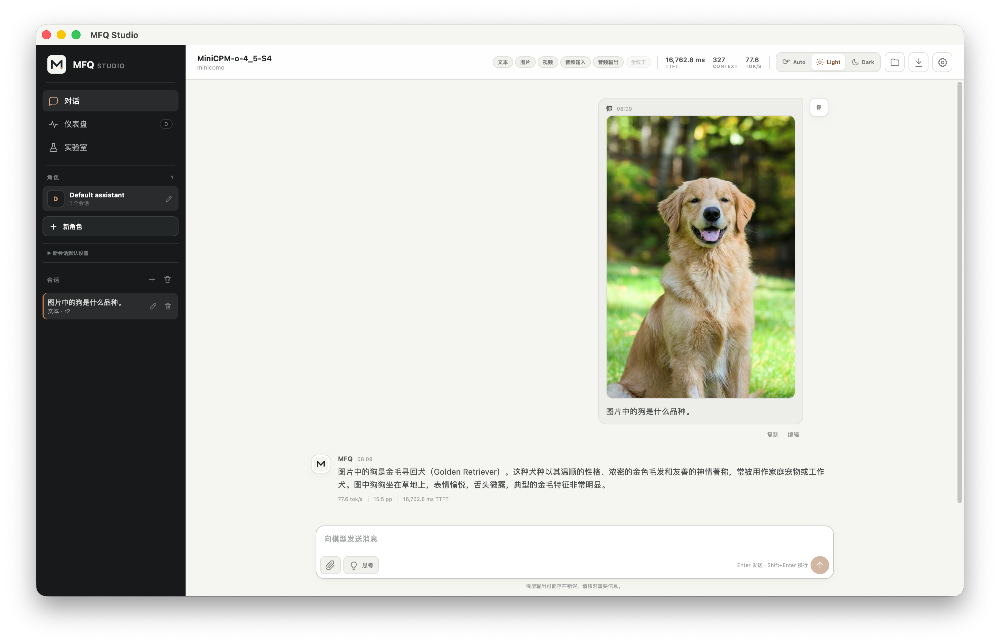

<div align="center">

# TyloQuant MFQ


**神经元锚定的混合格式量化与高保真大语言模型推理**

**Every Bit. Maximum Fidelity.**

NINT · NVQ/NPQ · NEPQ · TPQ · 逐专家 MoE · CUDA · Metal · C++ 运行时

</div>

<p align="center">
  <a href="./README.md">English</a> | <strong>中文</strong>
</p>

<p align="center">
  <a href="https://huggingface.co/Tylogi">Hugging Face 模型主页</a> · <a href="https://www.modelscope.cn/profile/Tylogi">ModelScope 模型主页</a>
</p>

## 项目简介

**TyloQuant MFQ**（简称 **MFQ**）是一套面向高保真大语言模型部署的混合格式量化与推理方案。它在设计量化格式时同时考虑精度分配和推理内核，支持让每个权重平均占用 `0.84–8.30` 位（bpw）的自定义编码，可按计算组或混合专家模型（MoE）中的单个专家分配精度。C++ 运行时可通过原生 CUDA 和 Metal 路径直接计算量化后的权重，无需先将其完整还原为高精度权重。

公开的 MFQ 模型采用统一的 `V`/`S` 命名：对应 llama.cpp `IQ*` 的向量量化模型使用 `V`，对应 `Q*_K*` 的标量量化模型使用 `S`。例如：`IQ3_XXS → V3-XXS`，`Q4_K_XL → S4-L`。



## 安装

### 环境要求

#### 通用

- Git
- [uv](https://docs.astral.sh/uv/)
- CMake `>=3.26` 与原生 C++ 工具链

#### 推理后端（二选一）

- **CUDA：** Linux 或 Windows、NVIDIA GPU，以及包含 `nvcc`、cuBLAS 和 CUDA 运行库的 CUDA Toolkit `>=12`。
- **Metal：** Apple 芯片与 macOS；`metal` 可选依赖组会安装 MLX 及其原生运行时文件。

#### 可选

- 仅在 MFQ 需要从源码构建浏览器界面时才需要 Node.js 与 npm；缺少它们时，`mfq serve` 仍可提供 API。

`uv` 会在需要时自动配置 MFQ 要求的 Python `>=3.10` 运行环境，无需单独安装 Python。

### 从源码安装

命令行统一使用 `mfq`。在 PowerShell 中，请将多行命令写成一行，或用反引号替换末尾的 `\`。

```shell
git clone https://github.com/Tylogi/TyloQuant.git MFQ
cd MFQ
```

#### CUDA（Windows 或 Linux）

原生 CUDA 推理不需要 PyTorch 或 LibTorch。

```shell
uv sync --extra daemon
uv run mfq build --backend cuda
```

#### Metal（Apple 芯片）

```shell
uv sync --extra daemon --extra metal
uv run mfq build --backend metal
```

需要离线量化或校准时，安装相应的可选依赖组：

```shell
# CUDA
uv sync --extra daemon --extra train --extra calibration

# Apple 芯片
uv sync --extra daemon --extra metal --extra train --extra calibration
```

`mfq build` 会自动探测操作系统和推理加速器。自定义 CMake 配置参数放在 `--` 之后，例如：

```shell
uv run mfq build -- -DCMAKE_CUDA_ARCHITECTURES=90
```

`mfq build` 会把可执行文件和 CMake 参数写入 `build/mfq-runtime.json`。`mfq serve` 会复用该构建；即使使用了自定义 `--build-dir`，可执行文件丢失时也会按原配置重建。

验证安装：

```shell
uv run mfq --help
uv run mfq build --help
```

## 快速开始

暂不加载模型，先启动服务：

```shell
uv run mfq serve
```

打开 <http://127.0.0.1:8090/>，并在另一个终端检查 API：

```shell
curl http://127.0.0.1:8090/health
```

从 [Hugging Face](https://huggingface.co/Tylogi) 或 [ModelScope](https://www.modelscope.cn/profile/Tylogi) 下载 MFQ 文件。可以在 Studio 模型目录中加载，也可以重启服务并传入模型路径：

```shell
uv run mfq serve --model /absolute/path/to/model.mfq
```

模型状态变为 `ready` 后即可开始对话。模型目录、身份认证和 API 用法见 [`mfq serve`](./docs/cli/serve.md)。

## 网页界面

`mfq serve` 启动对外 API 和网页界面，并通过本机私有端口管理 C++ 工作进程。可以暂不加载模型，也可以在启动时直接加载：

```shell
uv run mfq serve
uv run mfq serve --model path/to/model.mfq --host 127.0.0.1 --port 8090
uv run mfq serve --model-dir path/to/models --host 127.0.0.1 --port 8090
```

`--host` 和 `--port` 控制对外 API 的监听地址，默认是 `127.0.0.1:8090`。打开命令输出的网页地址即可。

桌面版 Studio 的 **Models and jobs**（模型与任务）页面可直接加载本地 `.mfq` 文件，不会复制模型。选择任一分片时，会自动加载同一模型的全部分片。

## 量化

`mfq quantize` 接受 Hugging Face（HF）的 `safetensors` 模型目录、满精度 MFQ 或满精度 GGUF。仅执行量化时，安装 `train` 可选依赖组：

```shell
uv sync --extra train
```

将 Hugging Face 模型权重量化为统一 NINT4：

```shell
uv run mfq quantize model-hf model-NINT4.mfq \
  --bits 4 --groupsize 24 --sub-bits 6 --backend auto
```

不做量化，直接把原始模型权重写入满精度 MFQ：

```shell
uv run mfq quantize model-hf model-full.mfq --full-precision
```

混合 GGUF 量化方案、逐专家覆盖规则、MTP 预测头补全、重要神经元、分片和断点续作见 [`mfq quantize`](./docs/cli/quantize.md)；激活重要性矩阵（imatrix）和校准见 [`mfq calibrate`](./docs/cli/calibrate.md)。

## 核心结果

### DeepSeek-V4-Flash-0731


**评测：** 官方 0731 权重，WikiText-2 共 573 个评测片段、146,115 个计分词元，`ctx=512`。

| 发布档位 | 大小 | 平均 KLD ↓ | 首选词元一致率（same-top）↑ |
|---|---:|---:|---:|
| S | 77.519 GiB | `0.313576` | `82.2913%` |
| M | 88.007 GiB | `0.244488` | `84.5300%` |
| L | 98.007 GiB | `0.201444` | `86.0753%` |

**同体积对比：** 与三组大小最接近的 Unsloth Dynamic（UD）基线相比，MFQ 将平均 KLD 降低 **34.24–51.42%**。

### Qwen3.5-9B：文件大小与平均 KLD


- **评测：** 完整 WikiText-2，共 145 个评测片段、148,335 个计分词元；所有档位使用同一 BF16 参考模型。
- **结果：** 上图每个匹配精度档位中，MFQ 的原始平均 KLD 均更低。

### Qwen3.6-27B：文件大小与质量


- **评测：** 完整评测包含 145 个片段，统一使用 `ubatch=2048`；图中每个档位均覆盖全部评测片段。
- **对比：** 每个 MFQ 文件均与大小相近的 Unsloth Dynamic 基线模型配对。
- **指标：** 平均 KLD 越低，说明输出分布越接近参考模型；首选词元一致率越高越好。

## 工作原理

| 层次 | 设计 | 作用 |
|---|---|---|
| 权重格式 | NINT、NVQ、NPQ、NEPQ、TPQ | 提供从 8 位到不足 1 位的不同质量档位 |
| 稠密层分配 | 重要性感知分配 | 按计算组选择精度 |
| MoE 分配 | 逐专家精度分配 | 将更多码率分配给预期输出贡献更高的专家 |
| 专家容器 | NINTM v2 | 在同一 MoE 张量中保存不同格式 |
| 运行时资源 | 保留的 `BLOB` 记录 | 在 MFQ 文件中保存配置、分词器、对话模板和特殊词元元数据 |
| 推理 | CUDA/Metal 内核与 C++ 运行时 | 不还原完整的 FP16 权重，直接计算量化后的权重 |

NINT 在每个输出神经元的权重行内共享仿射元数据，并把节省的空间用于更短的局部分组。低于 4 位时，NVQ、NPQ 与 NEPQ 使用短向量编码，并采用感知专家差异的码本共享方式。分配器依据序列化后的实际字节数选择格式，NINTM 再将兼容的专家分组，直接计算量化后的权重。

## 当前支持范围

> [!NOTE]
> 运行时仍处于实验阶段。CUDA 默认使用单块 GPU。

- `端到端`：原生 MFQ 加载、提示词预填充、逐词解码与文本生成。
- `部分支持`：已有架构相关组件，但没有完整的公开模型运行时。
- `专用路径`：使用独立的 TPQ/MFQ 执行路径。

| 模型或系列 | 转换与封装 | CUDA 推理 | Metal 推理 | 支持范围或当前限制 |
|---|---|---|---|---|
| Qwen3.5 | HF/GGUF/满精度 MFQ | 端到端 | 端到端 | 全注意力/线性注意力混合因果语言模型 |
| Qwen3.6 | HF/GGUF/满精度 MFQ | 部分支持 | 部分支持 | 路由 MoE 组件；暂无公开端到端运行时 |
| Gemma4 | HF/GGUF 与 MFQ 分片 | 端到端 | 端到端 | 混合全注意力/滑动窗口注意力 |
| DeepSeek-V4-Flash | HF/GGUF、逐专家 MFQ 与 TPQ | 端到端 | 端到端 | 压缩、索引器与稀疏注意力路径 |
| MiniCPM-o 4.5 | 官方复合 HF 计算图转换为 MFQ | 端到端 | 端到端 | 运行时需要官方模型目录 |
| GLM-MoE-DSA | 原生 MFQ 与混合精度 | 端到端 | 端到端 | 稠密/稀疏 MLA 路径 |
| Kimi-K3 | TPQ/MFQ 封装 | 专用路径 | 专用路径 | 仅使用 TPQ/MFQ 执行路径 |

通用能力：

- NINTM v2 流式转换；
- 自包含与分片 MFQ 文件；
- Python 与 C++ 加载；
- 支持服务器发送事件（SSE）的 OpenAI 兼容 API。

内核和模型细节：[运行时支持矩阵](./docs/runtime-support.md)。

## 文档

### CLI 与服务

- [`mfq build`](./docs/cli/build.md)
- [`mfq quantize`](./docs/cli/quantize.md)
- [`mfq calibrate`](./docs/cli/calibrate.md)
- [`mfq serve` 与模型管理](./docs/cli/serve.md)
- [HTTP API](./docs/api/http.md)
- [WebSocket API](./docs/api/websocket.md)

### 运行时与验证

- [运行时支持矩阵](./docs/runtime-support.md)
- [运行时采样配置](./docs/runtime-sampling-profiles.md)
- [原生 CUDA 运行时验证](./docs/cuda-native-runtime-validation.md)

### 量化与模型集成

- [逐专家联合预算求解器](./docs/ew-joint-solver.md)
- [MiniCPM-o 4.5 运行时](./docs/minicpmo45.md)
- [自包含发布包](./docs/release.md)

## 致谢

MFQ 使用或参考了以下项目：

- [llama.cpp](https://github.com/ggml-org/llama.cpp)：GGUF 互操作、推理后端和评测工具。
- [oMLX](https://github.com/jundot/omlx)：Apple 芯片性能与运行时设计参考。
- [MLX](https://github.com/ml-explore/mlx)：macOS 路径使用的 Apple 芯片数组计算框架与 Metal 运行时。
- [PyTorch](https://github.com/pytorch/pytorch) 与 [Transformers](https://github.com/huggingface/transformers)：模型接入与量化基础设施。
- [Unsloth](https://github.com/unslothai/unsloth)：用于对比的动态量化模型。

许可证：[Apache License 2.0](./LICENSE)。
