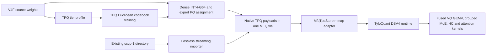

# TPQ 与 MFQ 融合说明

TPQ 是这套 Product Quantization 格式与运行时的正式名称。CCCP 是早期开发名称，
仅用于标识已有的 `cccp.json / cccp-1` 目录工件、兼容 API 和历史来源。原生 TPQ MFQ
指保存相同索引、码本和 dense INT4 payload 的单个 `.mfq` 文件。

兼容规则：

| 层面 | 新写入 | 新版读取 | 历史名称 |
|---|---|---|---|
| MFQ dtype | `TPQ-X/W/V/VV`、`TPQ-I4G64` | 同时接受 `TPQ-*` 与 `CCCP-*` | `CCCP-X/W/V/VV`、`CCCP-I4G64` |
| payload | `CPQ1`、`CI41` v1 | 字节与 tier ID 不变 | 完全相同 |
| 目录 manifest | 保留历史结构 | 接受 `cccp.json / cccp-1` | `cccp.json / cccp-1` |
| Python / CLI | `mfq.*.tpq`、`mfq tpq` | 旧导入与命令仍可用 | `mfq.*.cccp`、`mfq cccp` |

旧 runtime 不认识新文件目录中的 `TPQ-*` dtype；已有模型由新版 runtime 继续直接读取，
无需重写或重新量化。

当前融合提供两条入口：

1. 将已有 `cccp-1` 目录流式转换为一个 MFQ 文件。索引、码本和 dense 权重保持原值，
   不经过反量化或重新量化。
2. 从 DeepSeek-V4-Flash 源权重出发，按 TPQ 原始的 weight-only 目标训练码本，
   再直接写出 MFQ 文件。

推理继续使用 TPQ 的 DeepSeek-V4 图、专家缓存和 CUDA kernel。MFQ 内置 TPQ 生产运行
依赖，并增加单文件容器、流式量化、mmap 读取、低显存内存策略和统一 CLI。显式指定的
外部 TPQ 目录仍可覆盖内置版本，便于协作开发和独立升级。

## 1. 系统关系



融合遵守以下边界：

- TPQ 的四档 PQ 几何、码本类型、索引类型和 dense `int4-g64` 保持不变。
- 码本训练使用未加权的欧氏平方误差，没有引入 imatrix。
- 已有 `cccp-1` 工件的导入是表示级无损转换。
- 专家计算仍使用 TPQ 的 `VQWeight` 和融合 kernel。
- NINTM 只负责组织不同 TPQ 档位，不会把 TPQ 权重改写成 NINT、NVQ 或其他格式。

## 2. TPQ 格式在 MFQ 中的表示

### 2.1 Routed expert PQ

一个专家矩阵按行切成长度为 `D` 的短向量，每个短向量保存一个码本索引：

```text
W[r, b*D:(b+1)*D] ~= codebook[index[r,b], :]
```

生产档位定义如下：

| TPQ 档位 | 向量维度 D | 码本大小 K | 信息量/索引 | MFQ 物理索引 | 逻辑 index bpw | 物理 index bpw |
|---|---:|---:|---:|---:|---:|---:|
| `x` | 8 | 256 | 8 bit | `uint8` | 1.0 | 1.0 |
| `w` | 8 | 4096 | 12 bit | `uint16` | 1.5 | 2.0 |
| `v` | 4 | 256 | 8 bit | `uint8` | 2.0 | 2.0 |
| `vv` | 4 | 4096 | 12 bit | `uint16` | 3.0 | 4.0 |

`w` 和 `vv` 的码本只需要 12 bit 编号。原 TPQ kernel 使用字节或双字节对齐的索引，
因此 MFQ 同样保存为 `uint16`。表中的逻辑 bpw 表示索引信息量，物理 bpw 表示当前文件
和显存中的真实开销。码本为 `[K,D]` 的 FP32 数组，其开销按层、投影和档位共享。

MFQ 为四档注册以下公开 dtype：

```text
TPQ-X
TPQ-W
TPQ-V
TPQ-VV
```

每个 payload 包含：

```text
CPQ1 header
logical matrix shape
row count
FP32 codebook [K,D]
uint8 or uint16 indices [rows, columns/D]
```

头部记录 tier、`D`、`K`、物理索引宽度、axis 和矩阵宽度。读取时会校验形状、索引范围、
payload 尾部长度和码本有限性。

### 2.2 Dense INT4-G64

TPQ dense 矩阵使用对称 `int4-g64`：

```text
scale[r,g] = max(abs(W[r,g])) / 7
q[r,i]     = clamp(round(W[r,i] / scale[r,g]), -7, 7)
W_hat      = q * scale
```

两个 4 bit 值打包进一个字节，group scale 使用 FP16。名义存储开销为：

```text
4 + 16/64 = 4.25 bpw
```

MFQ dtype 为 `TPQ-I4G64`，payload 使用 `CI41` 版本头、packed values 和 FP16 scales。
直接量化流程只量化满足以下条件的 dense 张量：

- 二维矩阵；
- 元素数不少于 65,536；
- 输入宽度能被 64 整除。

其余小张量和非矩阵保存为 F32。导入已有 `cccp-1` 目录时，已有 F16、F32、I32、I64
张量会保持源 dtype。

### 2.3 NINTM 如何承载 TPQ

DeepSeek-V4-Flash 每层有 256 个 routed experts。一个逻辑专家张量的形状为：

```text
[expert_count, rows_per_expert, input_width]
```

NINTM v2 按物理格式把专家组成多个同质 pool：

```text
NIM2 header
  pool TPQ-V:
    global expert IDs
    dtype = "TPQ-V"
    one shared codebook
    contiguous indices for all experts in this pool
  pool TPQ-W:
    ...
```

`gate + up` 与 `down` 分别保存为一个 NINTM record。一个 pool 只保存一次码本，expert ID
负责从全局专家号映射到 pool 内的连续行区间。TPQ pool 不需要额外 runtime metadata。

源 `tiers_per_layer` 字符映射为：

| 源字符 | MFQ family |
|---|---|
| `x` | `TPQ-X` |
| `w` | `TPQ-W` |
| `v` | `TPQ-V` |
| `V` | `TPQ-VV` |

这种表示允许 NINTM 同时承载 TPQ、NINT、NVQ、NPQ 和 NEPQ。当前 TPQ 生产流程写
TPQ family；loader 也接受历史文件中的 CCCP expert dtype。

## 3. 现有 CCCP 工件的导入

入口：

```bash
mfq tpq import \
  --input /path/to/cccp-directory \
  --output /path/to/model.mfq \
  --row-chunk 4096 \
  --workers 8
```

导入器执行以下工作：

1. 校验 `cccp.json`、dense 文件、每层 expert shard 和 VQ 定义。
2. 逐张量读取 dense safetensors，保留 packed INT4 与 scale。
3. 逐层读取 expert shard，并按实际 tier 构造 NINTM pool。
4. 将 zlib expert index 解压为源 kernel 使用的 `uint8` 或 `uint16` 连续数组。
5. 每个 pool 只复制一次 `cb.gu.<tier>` 或 `cb.dn.<tier>`。
6. 先写 `.partial`，全部 record 长度验证通过后再替换目标文件。

导入过程不会生成浮点专家矩阵，也不会重新执行 nearest-codeword assignment。对同一个
expert，导入前后的 codebook 和 index 数组逐元素相同。

zlib 只用于 `cccp-1` 目录的磁盘压缩。MFQ 文件保存 GPU 可直接读取的固定宽度 index，
因此单文件可能略大于启用 zlib 的源目录，同时省去运行时逐专家解压。

## 4. 从源权重直接量化

### 4.1 生成精度方案

严格复现已有 CCCP 工件时，输入完整的 `tiers_per_layer`：

```json
{
  "tiers_per_layer": {
    "0": "vvvvw...",
    "1": "vvwvw..."
  }
}
```

```bash
mfq tpq prepare \
  --profile tiers.json \
  --output tpq-scheme.json
```

固定 tier 模式会逐专家保留源字符，不执行自动升档。

MFQ 也支持从非负 expert score 生成方案：

```text
v coverage  = 96.5%
w coverage  = 99.7%
vv          = 单专家占本层 score 总量至少 25%
```

score 模式会记录逐专家 score，并可在码本训练后依据 joint gate-up/down relative RMSE
把异常专家升到 `v` 或 `vv`。该模式属于 MFQ 提供的方案生成能力。做源实现等价实验时应使用
固定 `tiers_per_layer`。

### 4.2 训练码本

```bash
mfq tpq train-v4f \
  --input /path/to/DeepSeek-V4-Flash \
  --scheme tpq-scheme.json \
  --device cuda
```

默认训练参数与当前 CCCP V4F 流程一致：

| 参数 | 普通 tier | `vv` tier |
|---|---:|---:|
| 每专家最多采样点 | 50,000 | 300,000 |
| 每个 cohort 最多采样专家 | 32 | 32 |
| Lloyd iterations | 12 | 12 |
| restarts | 2 | 2 |
| 初始化 | k-means++ | k-means++ |
| 目标 | Euclidean SSE | Euclidean SSE |
| imatrix / 激活权重 | 无 | 无 |

训练粒度是 `layer × projection × tier`。`gate_up` 和 `down` 各有独立码本，同一 tier
中的专家共享该码本。训练点只来自当前 tier 的专家，避免不同精度 cohort 之间的分布混合。

码本工件保存为 `.npz`，包含 family、`D`、`K`、FP32 codebook、SSE、迭代历史和
`objective=euclidean_sse`。量化阶段会拒绝目标名不同或声明使用 imatrix 的工件。

### 4.3 写出单文件

```bash
mfq tpq quantize-v4f \
  --input /path/to/DeepSeek-V4-Flash \
  --scheme tpq-scheme.json \
  --output DeepSeek-V4-Flash-TPQ.mfq \
  --work-dir /path/to/work \
  --device cuda \
  --row-chunk 512
```

流程按 dense tensor 和 expert layer 流式读取源 checkpoint。专家 assignment 在 GPU 上执行，
临时 blob 按 record 写入，最终合并为 MFQ v2。中间 blob 的大小与目标 payload 不一致时会停止。

新 TPQ 直接量化文件的 MFQ header 记录：

- `source_format = tpq-1`
- 原始 checkpoint index 的 SHA-256
- scheme 的 SHA-256
- 完整 `tpq_manifest`
- 每个 TPQ tier 的物理 index bit width
- `mtp_included = false`

从历史 `cccp-1` 目录导入时，`source_format` 保留为 `cccp-1`，同时记录
`tpq_manifest` 与兼容用 `cccp_manifest`。当前 DeepSeek-V4-Flash TPQ 文件不包含 MTP 权重。

## 5. 运行时接入

### 5.1 打开模型

`open_tpq_artifact()` 接受以下输入：

- 历史 `cccp.json / cccp-1` TPQ 模型目录；
- 带 `tpq_manifest` 或兼容 `cccp_manifest` 的原生 MFQ 文件。

原生文件由 `MfqTpqStore` 适配到 TPQ 的 `CCCPStore` 接口。TPQ 的
`DSV4TPQModel` 构造和计算图无需修改。

当前内置 TPQ2 同时包含 DeepSeek-V4、GLM 和 Kimi-K3 计算图。Kimi 路径由
`mfq/_vendor/tpq/engine.py` 根据 `model_family=kimi_k3` 或 KDA 配置分派至
`kimi_model.py` 的 `KimiK3TPQModel`；`kimi_hybrid.py` 提供紧凑专家缓存与 Top-16
融合执行，`configs/kimi_k3.json` 声明 2-8 卡 TP 配置。该 Kimi 路径用于 TPQ 目录工件；
当前原生单文件 `MfqTpqStore` 适配器仍以 DeepSeek-V4 图为主。

```bash
mfq tpq inspect /path/to/model.mfq

mfq tpq run /path/to/model.mfq \
  --tokenizer-root /path/to/hf-tokenizer \
  --device cuda \
  --max-ctx 32768 \
  --cache-gb 80 \
  --vram-gb 12 \
  --spec 0
```

单个 MFQ 文件不打包 tokenizer。`--tokenizer-root` 提供 tokenizer 与 generation config；
运行时会生成一个临时目录供 TPQ chat 入口读取，不复制模型权重。

TPQ 运行时的加载优先级为：

1. `--tpq-root` 显式目录；
2. `MFQ_TPQ_ROOT` 环境变量；
3. 已安装的 `tpq` 包；
4. `mfq/_vendor/tpq` 内置生产运行时；
5. 本地 `references/tyloquant-pq` 开发目录。

显式目录不存在时直接报错，避免悄然改用另一份 TPQ 实现。内置目录只包含模型图、专家
缓存、异构 residency、融合 grouped VQ kernel 及其直接依赖，不包含上游实验脚本和工件。

### 5.2 mmap 与直接 expert view

`MfqTpqStore` 启动时只读取 MFQ header 和 record directory。每个 NINTM expert record 会被
解析为以下只读信息：

```text
global expert -> (pool, local expert index)
pool          -> codebook, index byte offset, D, K, rows, columns
```

专家索引通过 `numpy.frombuffer(mmap)` 建立 view。`load_expert(layer, expert)` 将对应的
GU/DN view 包装成 TPQ `VQWeight`：

```text
VQWeight(index_view, shared_codebook, logical_columns)
```

该路径不创建完整 NINTM Python tensor，也不反量化权重。dense INT4 直接包装为 TPQ
`Int4Weight`。

### 5.3 CUDA kernel

MFQ 沿用 TPQ 的融合 kernel：

1. GU VQ GEMV；
2. BF16 SwiGLU；
3. down VQ GEMV；
4. FP32 route-weight reduce。

一次 top-k MoE 计算使用固定 workspace。VQ kernel 支持 `uint8` 和 `uint16` index，
每个 block 含 8 个 warp，每个 warp 负责一个输出行，输入激活暂存在 shared memory。
码本查找和 dot product 在同一 kernel 内完成，不生成解码后的权重矩阵。

同一 index dtype 的不同向量维度可以进入 slot kernel。例如 `x` 与 `v` 都使用 `uint8`，
`w` 与 `vv` 都使用 `uint16`。index dtype 不同的 active experts 会按兼容签名分组执行。

DeepSeek-V4 的 Hyper-Connections、sqrt-softplus router、attention、分页 KV 和长上下文
压缩路径继续使用 TPQ 原实现。

## 6. 显存与主存策略

运行时按可用显存和主存选择以下模式：

| 模式 | Expert index 位置 | 适用情况 |
|---|---|---|
| 全 GPU | 全部 expert index 流式装入固定 GPU arena | 显存可容纳整个模型 |
| GPU arena + host resident | 热 expert 在固定 arena，完整压缩 expert 池锁页常驻主存 | 24/32 GiB 单卡 |
| 有限 host cache | GPU arena 与有限主存缓存按需换入 | 主存不足以容纳完整 expert 池 |

相关环境变量：

| 变量 | 含义 |
|---|---|
| `TPQ_GPU_FULL_RESIDENT=0/1/auto` | 是否允许全部 expert 常驻 GPU |
| `TPQ_FULL_RESIDENT=0/1` | 是否允许全部压缩 expert 常驻主存 |
| `TPQ_HOST_PIN_GB=auto/<number>` | host pin 预算 |
| `TPQ_DENSE_BF16=all` | 将 dense INT4 展开为 BF16 常驻，以显存换速度 |
| `TPQ_FUSED=1` | 启用 TPQ 融合扩展 |
| `TPQ_GROUPED=1` | 启用 grouped expert kernel |
| `TPQ_PAGED_KV_FUSED=1` | 启用融合分页 KV 路径 |

MFQ 会读取 Linux cgroup v2 的 `memory.max`、`memory.current` 和可回收 file cache。
当完整 host residency 超出有效内存时，运行时会关闭该模式。完整 resident 大小由每种 expert
signature 的 slot bytes 精确计算，不依赖目录文件大小。

单文件 mmap 被复制到锁页主存或 GPU 后，运行时对对应 record 调用：

```text
mmap.madvise(MADV_DONTNEED)
posix_fadvise(POSIX_FADV_DONTNEED)
```

这会释放干净的文件缓存页，避免同一份 expert index 同时占用 mmap page cache 和 resident
内存。32 GiB 模拟配置下，修正后的进程 RSS 约 71 GiB，cgroup 总量约 72.6 GiB。

## 7. 当前工件

以下数据来自 2026-07-26 的 DeepSeek-V4-Flash 固定 tier 工件：

```text
DeepSeek-V4-Flash-TPQ-fixed-tier.mfq
```

| 项目 | 数值 |
|---|---:|
| 文件字节数 | `73,543,040,484 B` |
| 十进制大小 | `73.543 GB` |
| 二进制大小 | `68.492 GiB` |
| Expert records | `64.852 GiB` |
| Dense、metadata 与其他 records | `3.641 GiB` |
| 主模型层数 | `43` |
| 每层 routed experts | `256` |
| Expert 总数 | `11,008` |
| MTP | 未包含 |

Expert tier 分布：

| Tier | Experts | 占比 | 物理 index bpw |
|---|---:|---:|---:|
| `v` | `4,146` | `37.664%` | `2.0` |
| `w` | `6,802` | `61.791%` | `2.0` |
| `vv` | `60` | `0.545%` | `4.0` |
| `x` | `0` | `0%` | `1.0` |

按 expert 数量加权，逻辑 index 码率为 `1.6965 bpw`，当前物理 index 码率为
`2.0109 bpw`。实际文件还包含每层各 tier 的 FP32 codebook、dense 权重和 metadata。

源 TPQ 文档中的目录工件约为 `67 GiB`。单文件大小差异主要来自 zlib index 被转换为 GPU
可直接读取的固定宽度数组，以及文件容器 metadata。

## 8. 推理性能

### 8.1 MFQ 单文件受控测试

测试平台为 NVIDIA RTX PRO 6000 Blackwell Server Edition。三个配置使用同一模型、同一
TPQ/MFQ 代码和同一 GPU，只改变 CUDA allocator 可用显存，以测量 residency 策略。

共同设置：

- BF16 compute；
- `spec=0`；
- greedy decode；
- `max_ctx=32768`；
- fused、grouped 和 paged-KV 路径启用；
- `TPQ_DENSE_BF16=all`；
- 相同英文长回答 prompt；
- 每次生成相同的 1,541 tokens。

| 配置 | 实际 allocator 上限 | GPU expert arena | GPU experts | Host expert pool | Warm load | 端到端流式 decode | 相对全 GPU |
|---|---:|---:|---:|---:|---:|---:|---:|
| 全 GPU | 无人工限制 | `64.85 GiB` | `11,008` | `0` | `62-63 s` | **`20.49 tok/s`** | `100%` |
| 32 GiB 卡等效 | `29.4 GiB` | `14.35 GiB` | `2,436` | `64.9 GiB` | `90.8 s` | **`16.26 tok/s`** | `79.4%` |
| 24 GiB 卡等效 | `21.6 GiB` | `6.50 GiB` | `1,103` | `64.9 GiB` | `103.0 s` | **`15.05 tok/s`** | `73.5%` |

全 GPU 路径的内部峰值显存为 `78.692 GiB`，`nvidia-smi` 进程占用约 `81.4 GiB`。
原始无流式输出 benchmark 为：

| 生成长度 | 吞吐 |
|---:|---:|
| 256 tokens | `21.758 tok/s` |
| 512 tokens | `21.663 tok/s` |

自然流式请求的 `20.49 tok/s` 包含 tokenizer、sampling、SSE/终端输出与计时边界开销。

32 GiB 和 24 GiB 行属于显存容量模拟，可验证 MFQ 的 arena、host resident 与传输路径。
它们没有模拟 RTX 5090 或 RTX 4090 的算力、显存带宽与 PCIe 差异。

### 8.2 合作者 TPQ 物理 RTX 5090 数据

以下数据来自 `references/tyloquant-pq/README.zh-CN.md`，使用目录形式的 `cccp-1`
工件和物理 RTX 5090 32 GiB：

| 项目 | TPQ 实测 |
|---|---:|
| 短上下文 decode | `16.97 tok/s` |
| 连续 4,300-token decode | `17.92 tok/s` |
| 8,192-token prompt 后 decode | `16.06 tok/s` |
| 进程峰值显存 | `25.88-28.36 GiB` |
| Expert GPU arena | `12.00 / 14.54 GiB` |
| 完整锁页 expert pool | 约 `64.5 GiB` |
| 启动时间 | 约 `80-90 s` |

两组测试的硬件、prompt 和输出长度不同，不能直接计算 MFQ adapter 的硬件加速比例。
它们共同验证了目录入口和 MFQ 单文件入口都能进入 TPQ 的生产低显存路径。

## 9. 数值与结构验证

TPQ 专项测试覆盖：

| 测试 | 验证内容 |
|---|---|
| `tests/test_formats/test_cccp.py` | 四档 PQ、INT4-G64、payload 尺寸、坏数据拒绝 |
| `tests/test_cccp_import.py` | 目录到 MFQ 的 index/codebook 等价、NINTM 映射、TPQ store |
| `tests/test_cccp_runtime.py` | 工件校验、TPQ 加载、resident patch、tokenizer host |
| `tests/test_cccp_packed_kld.py` | packed-reference KLD 方向和 state 格式 |

当前独立 worktree 的 TPQ 专项结果：

```text
27 passed
```

内置 TPQ 的 expert slot、GPU arena、异构缓存预算和 ExpertPool 上游测试：

```text
35 passed
```

wheel 构建与隔离安装检查确认 `mfq/_vendor/tpq/csrc/vq_gemv.cu` 已进入安装包，且隔离
环境默认加载内置 TPQ。完整 MFQ 回归和 CUDA kernel 编译尚未在本次独立 worktree 中执行。
Windows 测试环境没有安装 MSVC `cl`，PyTorch 扩展探测产生一条 warning。

导入测试会逐元素比较源 codebook/index 重建结果与 MFQ 重建结果，并再次通过 TPQ
`VQWeight.dequant()` 比较。三段 packed-logits 回归也已验证 MFQ store 与旧目录 store
得到相同的累计评测指标。

Packed-logits 回归同时记录：

```text
mean_t D_KL(P_ref || P_quant)
mean_t D_KL(P_quant || P_ref)
```

其中第一项是脚本的 primary metric，第二项对应：

```text
mean_t sum_i P_quant[t,i] *
    (log P_quant[t,i] - log P_ref[t,i])
```

评测 state 每完成一个 chunk 原子更新一次，支持 `--resume`。对外比较时需要同时记录
KLD 方向、reference 文件、context、chunk 数和 scored token 数。

## 10. 源码对应关系

| 责任 | TPQ / CCCP 历史实现 | MFQ 融合位置 |
|---|---|---|
| PQ tier 定义 | `references/cccp/cccp.py` | `mfq/formats/tpq.py` |
| Dense INT4-G64 | `references/cccp/cccp.py` | `mfq/quantize/tpq.py` |
| Euclidean k-means | `references/cccp/cccp.py` | `mfq/quantize/tpq.py` |
| Tier profile | `cccp.json` / profile JSON | `mfq/calibration/tpq.py` |
| Scheme 生成 | TPQ quant CLI | `mfq/tools/prepare_tpq_scheme.py` |
| V4F 码本训练 | TPQ `dsv4quant` | `mfq/tools/train_tpq_v4f_codebooks.py` |
| V4F 直接量化 | TPQ `dsv4quant` | `mfq/tools/quantize_tpq_v4f_to_mfq.py` |
| 已有工件导入 | `cccp-1` directory | `mfq/tools/import_tpq_to_mfq.py` |
| 异构 expert 容器 | 每层 safetensors keys | `mfq/formats/moe.py`, `mfq/formats/io.py` |
| Expert store | `references/tyloquant-pq/store.py` | `mfq/runtime/tpq.py` |
| Residency 策略 | TPQ `ExpertPool` | `mfq/runtime/cccp_tpq_patch.py`, `mfq/_vendor/tpq/store.py` |
| 模型图 | TPQ2 DSV4 / GLM / Kimi-K3 | `mfq/_vendor/tpq/dsv4model.py`, `kimi_model.py` |
| VQ / grouped kernel | `references/tyloquant-pq/csrc/vq_gemv.cu` | `mfq/_vendor/tpq/csrc/vq_gemv.cu` |
| 用户入口 | TPQ chat scripts | `mfq/cli.py` 的 `mfq tpq ...` |

## 11. 当前支持边界

- TPQ 目录入口支持 DeepSeek-V4、GLM 和 Kimi-K3；原生单文件 adapter 当前主要支持 DeepSeek-V4。
- 单 GPU CUDA 路径已经实测。
- 原生 MFQ 需要外部 tokenizer 目录。
- MTP tensor 尚未写入原生 TPQ MFQ。
- TPQ 生产码本训练固定使用 weight-only Euclidean SSE。
- 低显存路径需要足够的系统内存；完整 resident 模式约需 65 GiB expert pool 加运行时开销。
- MFQ server 的 continuous batching 和多 GPU 调度尚未接入 TPQ 路径。

## 12. 修改 TPQ 时的维护检查

增加 tier 或更改码本几何时，需要同步检查：

1. `CccpPqSpec` 的 tier、`D`、`K` 和物理 index dtype。
2. `CPQ1` payload 的 pack/unpack 与精确尺寸计算。
3. NINTM pool dtype、expert ID 顺序和共享 codebook。
4. `MfqTpqStore.expert_signature_counts()` 的 GPU slot 尺寸。
5. TPQ slot kernel 对 index dtype、code dimension 和 top-k 的约束。
6. 目录导入、MFQ mmap、TPQ dequant 三层逐元素等价测试。
7. 相同 reference 上的 KLD、same-top、模型文件字节数、峰值显存和 decode 吞吐。

严格复现实验应优先使用固定 `tiers_per_layer`、原始 Euclidean codebook 和源物理 index dtype，
并保留输入 manifest 与 scheme 的 SHA-256。
