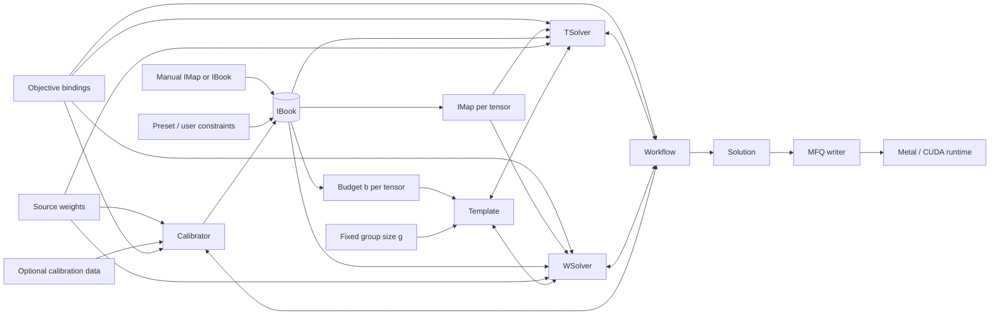
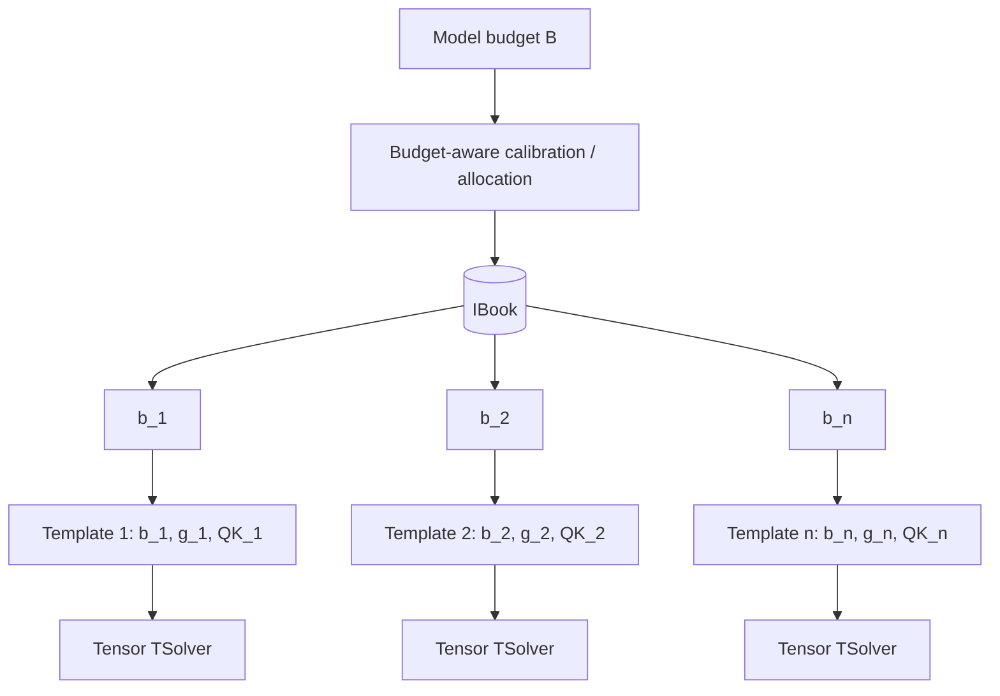
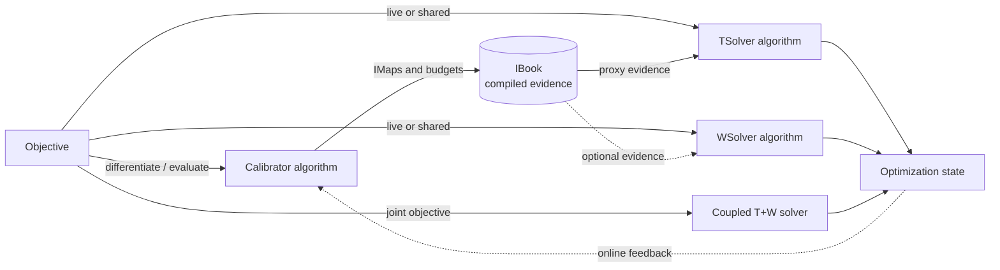
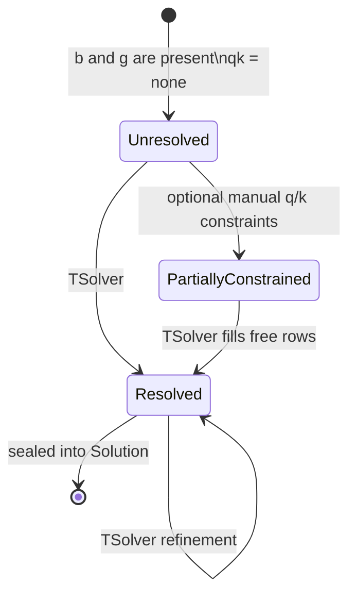
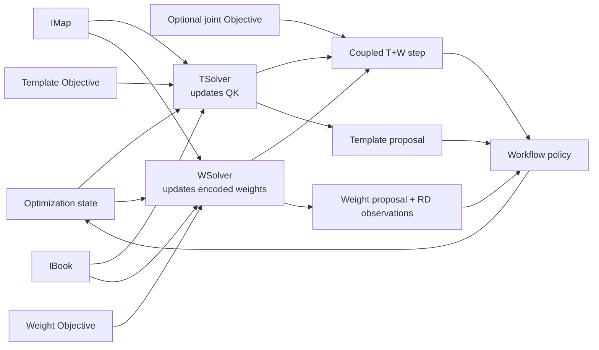
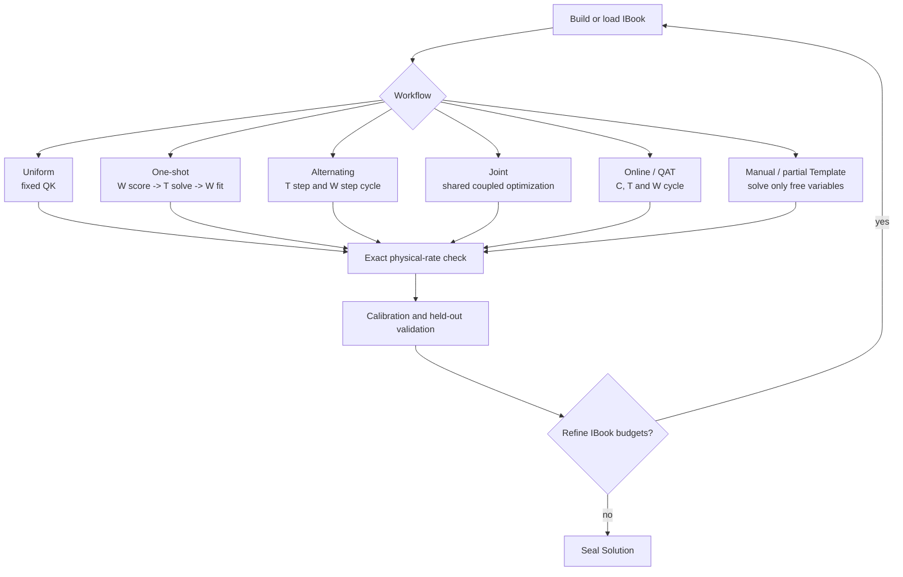
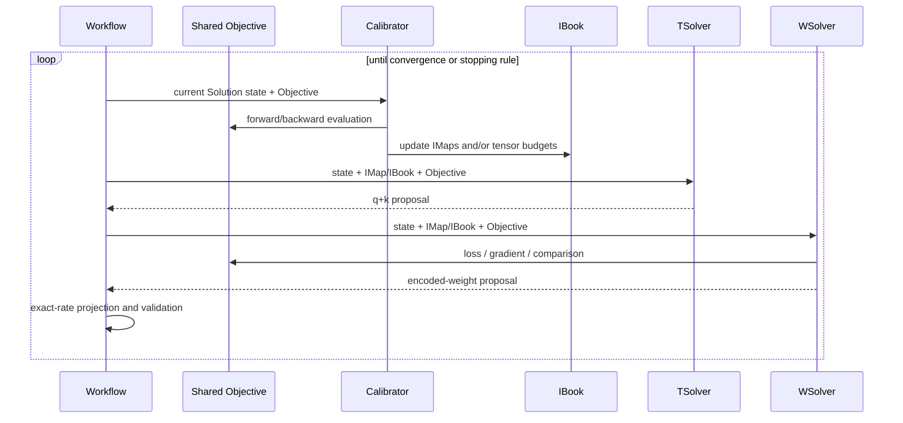
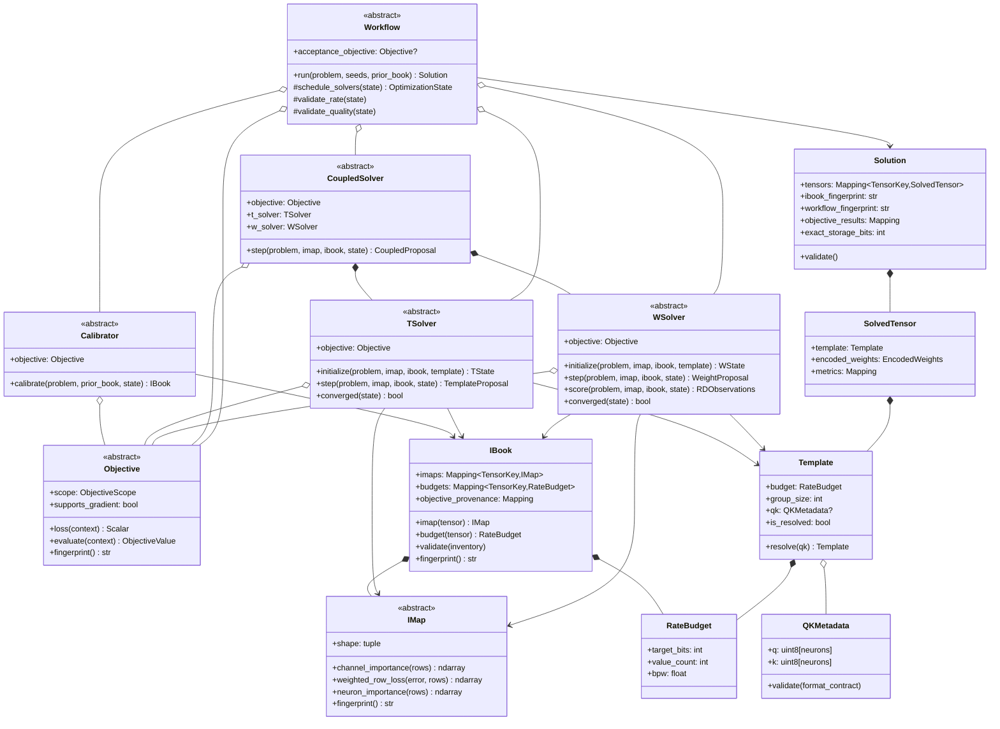
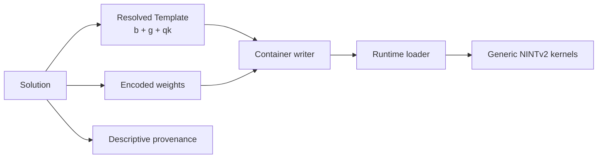

# MFQ Core v2 Architecture

This document is the implementation contract for NINTv2 calibration and
quantization. It describes ownership, data flow and abstract interfaces. It is
deliberately independent of model architecture, checkpoint naming, storage
writer and inference backend.

## Non-negotiable boundaries

1. A tensor `Template` has exactly three semantic fields: its BPW budget `b`,
   its fixed group size `g`, and its per-neuron `(q, k)` metadata matrix.
2. `g` is fixed for one NINTv2 tensor. It is the only NINT degree of freedom
   that is not allocated independently per neuron.
3. `b` and `g` are constraints. The `(q, k)` metadata matrix is the variable
   solved by a `TSolver`.
4. An `IMap` describes importance only inside one tensor. It never owns or
   infers that tensor's budget.
5. An `IBook` registers the model's `IMap` objects and the budget `b_t` for
   every tensor. In the initial implementation those budgets may be supplied by
   a preset or user. In later workflows a calibrator may solve them under a
   model-level budget `B` and write the result into the `IBook`.
6. An `Objective` defines what is minimized or evaluated, never how it is
   optimized. A Calibrator, TSolver, WSolver, or coupled TSolver+WSolver may
   each own an Objective. They may share one Objective or use different proxy
   Objectives.
7. `Calibrator`, `TSolver` and `WSolver` are peer optimization participants.
   Each is passed the relevant `IMap`/`IBook`, but its Objective may consume
   that evidence, use it only as a proxy, or deliberately ignore it. Neither
   Solver is permanently upstream of the other.
8. Only a `Workflow` owns Objective routing, participant ordering, iteration,
   joint execution, convergence, validation and feedback.
9. A `Solution` contains resolved Templates and actual encoded weights. The
   writer and runtime consume the Solution, never the calibrator or solvers.
10. Budget checks use exact physical storage, including q values, scale/minimum
   metadata, per-neuron q+k descriptors, anchors, padding and format framing.
11. All model-wide lookup uses canonical tensor names. None of these
    abstractions may contain architecture-specific quantization logic.

## End-to-end relationship



The bidirectional edges do not mean that either solver calls the other.
`Workflow` owns the interaction and passes an immutable optimization state
between steps.

## Two levels of budget allocation

Let `B` denote an optional model-level budget and `b_t` the budget of tensor
`t`.



The first implementation can start with fixed `b_t` values. Making `b_t`
calibrated later does not change the tensor-level Template or NINTv2 format:
it changes only how the `IBook` obtains its budget table.

The ownership rule is strict:

```text
IMap   = intra-tensor importance; no tensor budget
IBook  = canonical tensor registry + IMaps + per-tensor budgets
Template(t) = b_t + g_t + QK_t
```

## Objective: criterion, not algorithm

`Objective` is the criterion a component attempts to minimize or uses to
compare proposals. `BP`, `STE`, `SGD`, greedy allocation and coordinate search
are algorithms; end-to-end KL divergence, task loss and weighted SSE are
Objectives.

The same Objective can be used in three ways:

1. **Live:** a component evaluates or differentiates the Objective directly.
2. **Compiled:** a Calibrator evaluates the Objective and distils its local
   consequences into an IMap/IBook. A Solver then consumes that evidence as a
   tractable proxy.
3. **Independent:** a component receives the IMap/IBook for interface
   consistency but intentionally optimizes another Objective and may ignore
   the calibration evidence.



An IBook therefore records the fingerprint and provenance of the Objective
under which each IMap and budget was produced, but it does not contain the live
Objective implementation. A persisted IBook is calibrated evidence; an
Objective is executable optimization semantics.

Objectives may be model-wide, tensor-local or batch-local. Composite
Objectives may form weighted, constrained or lexicographic combinations, while
the same base Objective may have separate differentiable training and exact
evaluation views. These are Objective implementations, not new Workflow types.

Rate remains an exact constraint even when an Objective contains a Lagrangian
or other rate penalty for search. A Workflow must reject an over-budget state
regardless of its Objective value.

## Template state

The same Template value type has unresolved and resolved states:



Logically, `QK_t` is an unsigned matrix of shape `[neurons, 2]` whose columns
are absolute q and k values. Relative anchors, selector bit widths and cohort
packing are physical encoding details, not Template semantics.

A Uniform Template is simply a resolved Template whose `QK_t` rows are all
equal. It needs no calibration or Template search. Fixed NINTv1 profiles are
Uniform Template presets inside the NINTv2 space, not separate logical tensor
formats.

## Peer solver relationship

TSolver and WSolver may minimize the same Objective or different local
surrogates. Their most general relationship is

```math
IBook = Calibrate(\mathcal{O}_C, W, D),
```

```math
QK' = TSolve(\mathcal{O}_T, QK, W_q, IMap, IBook),
```

```math
W_q' = WSolve(\mathcal{O}_W, W_q, QK, IMap, IBook).
```

When they share a coupled Objective, this becomes the joint problem

```math
\min_{QK,\,W_q}\;\mathcal{O}_{TW}(W_q,QK;I_t,I_{book})
\quad\text{subject to}\quad
R(QK,g_t)\le b_t\,N_t.
```

`TSolver` owns `QK`; `WSolver` owns the encoded weight parameters `W_q`.
Their dependence is circular:

- the best q+k assignment depends on the distortion achievable by the weight
  solver at each assignment;
- the best encoded weights depend on the current q+k assignment;
- both receive the tensor-local IMap and model-level IBook, although a
  deliberately simple Solver may ignore either one.



No solver serializes a tensor, changes `g`, or silently changes `b_t`.

## Supported Workflow shapes



An alternating or joint Workflow may feed measured rate-distortion results
back into a budget-aware Calibrator. That outer loop may update `b_t` in the
IBook, while the inner tensor loop updates q+k and weights. This preserves the
distinction between cross-tensor budget allocation and intra-tensor Template
allocation.

If calibration changes `b_t`, Workflow creates a new Template constraint whose
budget matches the updated IBook. TSolver and WSolver never mutate the budget
field themselves.

Calibration is not restricted to the beginning of a Workflow. In an online
Workflow it is another scheduled participant:



For a joint step, the two Solver calls above are replaced by one coupled update
of q+k variables and encoded-weight variables. The TSolver and WSolver still
own their respective variables; coupling is a Workflow execution policy, not a
new persisted model format.

## Representative compositions

| Workflow | Calibrator + Objective | TSolver + Objective | WSolver + Objective | Interaction |
|---|---|---|---|---|
| Uniform baseline | none | bypassed; QK is fixed | scalar or weighted SSE | one weight fit |
| NAQ PTQ | NAQ statistics under the chosen model objective | IBook-weighted rate-distortion | IMap-weighted reconstruction | one-shot or alternating |
| BP allocation with simple weight fitting | BP under end-to-end KL | consumes the BP-derived IBook | plain SSE; deliberately ignores IBook | calibration -> T -> W |
| Coupled template and weight search | optional warm-start calibration | shared end-to-end or proxy Objective | the same shared Objective | joint T+W steps |
| Online QAT | STE/BP under end-to-end task or KL loss | optional projected q+k update under the same Objective | SGD under the same Objective | repeat C, T and W jointly or cyclically |

The third row is intentionally valid: calibration evidence can be passed only
to TSolver while a deliberately coarse WSolver performs ordinary SSE fitting.
Conversely, a WSolver may consume a rich IMap while TSolver is fixed or absent.
The architecture specifies composability, not one mandatory optimization
recipe.

QAT is therefore not a separate architectural pipeline. Bind the live
end-to-end Objective to the participants, use an STE/BP Calibrator, use an SGD
WSolver, optionally update q+k through TSolver, and let Workflow repeat or
jointly execute those steps. PTQ, online calibration and QAT differ by their
Objective bindings and schedule, not by their container or writer.

## Abstract class diagram



## Python interface sketch

This is an interface sketch, not an implementation. Names may be adjusted when
the existing calibration artifact types are migrated, but their ownership must
not change.

```python
from abc import ABC, abstractmethod
from dataclasses import dataclass
from typing import Mapping


TensorKey = str  # canonical MFQ tensor name


@dataclass(frozen=True)
class ObjectiveValue:
    total: float
    components: Mapping[str, float]


class Objective(ABC):
    """Executable criterion; contains no optimizer or update schedule."""

    @property
    @abstractmethod
    def scope(self) -> "ObjectiveScope": ...

    @property
    def supports_gradient(self) -> bool:
        return False

    @abstractmethod
    def loss(self, context: "ObjectiveContext") -> "Scalar": ...

    @abstractmethod
    def evaluate(self, context: "ObjectiveContext") -> ObjectiveValue: ...

    @abstractmethod
    def fingerprint(self) -> str: ...


@dataclass(frozen=True)
class RateBudget:
    target_bits: int
    value_count: int

    @property
    def bpw(self) -> float:
        return self.target_bits / self.value_count


@dataclass(frozen=True)
class QKMetadata:
    q: "UInt8Vector"
    k: "UInt8Vector"


@dataclass(frozen=True)
class Template:
    # Exactly three semantic members.
    budget: RateBudget
    group_size: int
    qk: QKMetadata | None = None

    @property
    def is_resolved(self) -> bool:
        return self.qk is not None


class IMap(ABC):
    """Importance within one tensor; never owns a tensor budget."""

    @property
    @abstractmethod
    def shape(self) -> tuple[int, int]: ...

    @abstractmethod
    def channel_importance(self, rows) -> "FloatArray": ...

    @abstractmethod
    def neuron_importance(self, rows) -> "FloatVector": ...

    @abstractmethod
    def weighted_row_loss(self, error, rows) -> "FloatVector": ...

    @abstractmethod
    def fingerprint(self) -> str: ...


@dataclass(frozen=True)
class IBook:
    imaps: Mapping[TensorKey, IMap]
    budgets: Mapping[TensorKey, RateBudget]
    provenance: "CalibrationProvenance"
    objective_provenance: Mapping[TensorKey, str]


@dataclass(frozen=True)
class OptimizationState:
    templates: Mapping[TensorKey, Template]
    encoded_weights: Mapping[TensorKey, "EncodedWeights"]
    rd_observations: Mapping[TensorKey, "RDObservations"]
    iteration: int


class Calibrator(ABC):
    objective: Objective

    @abstractmethod
    def calibrate(
        self,
        problem: "ModelProblem",
        prior_book: IBook | None = None,
        state: OptimizationState | None = None,
    ) -> IBook: ...


class TSolver(ABC):
    """Updates q+k Templates while preserving each tensor's b and g."""

    objective: Objective

    @abstractmethod
    def step(
        self,
        problem: "TensorProblem",
        imap: IMap,
        ibook: IBook,
        state: OptimizationState,
    ) -> "TemplateProposal": ...


class WSolver(ABC):
    """Updates encoded weights under the current Templates."""

    objective: Objective

    @abstractmethod
    def step(
        self,
        problem: "TensorProblem",
        imap: IMap,
        ibook: IBook,
        state: OptimizationState,
    ) -> "WeightProposal": ...

    @abstractmethod
    def score(
        self,
        problem: "TensorProblem",
        imap: IMap,
        ibook: IBook,
        state: OptimizationState,
    ) -> "RDObservations": ...


class CoupledSolver(ABC):
    """Joint execution policy over peer T/W variable owners."""

    objective: Objective
    t_solver: TSolver
    w_solver: WSolver

    @abstractmethod
    def step(
        self,
        problem: "TensorProblem",
        imap: IMap,
        ibook: IBook,
        state: OptimizationState,
    ) -> "CoupledProposal": ...


class Workflow(ABC):
    """Owns calibration, solver interaction, validation and sealing."""

    acceptance_objective: Objective | None

    @abstractmethod
    def run(
        self,
        problem: "ModelProblem",
        template_seeds: Mapping[TensorKey, Template],
        prior_book: IBook | None = None,
    ) -> "Solution": ...


@dataclass(frozen=True)
class SolvedTensor:
    template: Template       # must be resolved
    encoded_weights: "EncodedWeights"
    metrics: Mapping[str, float]


@dataclass(frozen=True)
class Solution:
    tensors: Mapping[TensorKey, SolvedTensor]
    ibook_fingerprint: str
    workflow_fingerprint: str
    objective_results: Mapping[str, ObjectiveValue]
    exact_storage_bits: int
```

`OptimizationState` is shared working state, not a persisted public artifact.
It allows either solver to observe the latest proposal from the other without
creating a parent-child relationship. A joint Workflow may optimize relaxed
q+k variables and encoded-weight variables in one step, then project both into
a valid immutable state before exact rate and quality checks.

## Exact rate contract

The optimizer must use an integer rate model. For a tensor with `N` neurons,
logical width `K`, fixed group size `g`, padded width `Kp`, and `G = Kp / g`,
the NINTv2 payload has the form

```text
R = R_fixed
  + sum_i(q_i * Kp)
  + sum_i(2 * k_i * G)
  + N * descriptor_bits
```

`R_fixed` includes the per-neuron high-precision anchors and all fixed format
framing/padding. `descriptor_bits` includes both q and k selectors. The actual
codec's exact packed lengths are authoritative; floating-point BPW is only a
derived reporting value. A proposal that exceeds `RateBudget.target_bits` is
invalid even if its rounded BPW appears equal.

## Solution and runtime boundary



Runtime-critical q+k descriptors are stored in the tensor payload. Descriptive
metadata may record the Workflow, Calibrator and solver identities, exact BPW,
IBook fingerprint and validation summary, but the runtime never interprets
those optimization details.

## Initial implementation mapping

The current experimental code should be moved behind these boundaries rather
than extended in place:

| Current responsibility | Target abstraction |
|---|---|
| End-to-end KL, task loss or weighted SSE criterion | `Objective` implementation |
| BP/STE derivation of importance from a criterion | `Calibrator` bound to an `Objective` |
| NAQ input and neuron importance entries | `IMap` implementations |
| Model-wide importance artifact and tensor bindings | `IBook` |
| Exact tensor rate calculation | `Template` rate validator |
| Candidate q+k encoding and distortion measurement | `WSolver.score` |
| Budget-constrained q+k assignment | `TSolver.step` |
| Re-encoding weights for a resolved q+k map | `WSolver.step` |
| Joint q+k and encoded-weight update | coupled TSolver+WSolver execution policy |
| Current direct writer-side allocation | one-shot `Workflow` |
| HF/GGUF streaming writer | `Solution` consumer only |

The first production Workflow should be conservative: fixed per-tensor budgets,
fixed `g`, NAQ IMaps, one candidate-scoring pass, one exact-budget Template
solve, one final weight solve, and held-out validation. Alternating, joint and
calibrated cross-tensor budget allocation can then be added without changing
the NINTv2 format or writer contract.
