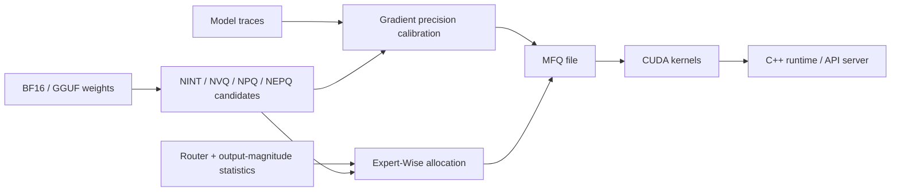

<div align="center">

# TyloQuant MFQ — Benchmarks and Technical Notes


**Neuron-anchored mixed-format quantization and high-fidelity LLM inference**

**Every Bit. Maximum Fidelity.**

NINT · NVQ/NPQ · NEPQ · Gradient Precision Calibration · Expert-Wise MoE · CUDA/C++ Runtime

</div>

<p align="center">
  <a href="../README.md">Project home</a> ·
  <strong>English</strong> | <a href="./benchmarks.zh-CN.md">中文</a>
</p>

This document collects TyloQuant MFQ's detailed quality, bitrate, and runtime
results. The project homepage intentionally presents only one headline result;
historical and exploratory measurements remain here for reference.

## Featured Gemma Result


At the same `17.0109 GB` disk size as `UD-Q4_K_XL`, **MFQ EW-4-L** reaches a
Mean KLD of `0.00234293`, versus `0.00424385` for the matched-size baseline.
That is a **44.79% reduction in Mean KLD**; lower is better.

| Model | Scheme | Disk space | Mean KLD |
|---|---|---:|---:|
| Gemma-4-26B-A4B-it | MFQ EW-4-L | `17.0109 GB` | **`0.00234293`** |
| Gemma-4-26B-A4B-it | UD-Q4_K_XL | `17.0109 GB` | `0.00424385` |

The figure places this matched-size result in the wider GGUF quantization
landscape. The sections below retain the complete project measurements and
their current qualification notes.

**TyloQuant MFQ** (or **MFQ**) is a research-oriented LLM inference project that
co-designs quantization formats, precision allocation, and inference kernels.
Guided by **Every Bit. Maximum Fidelity.**, it provides custom weight encodings
from `0.84-8.30 bpw`, assigns precision per compute group or MoE expert, and
executes packed weights directly through CUDA kernels and a C++ runtime.

## Core Design

| Layer | Design | Problem addressed |
|---|---|---|
| Weight formats | NINT, NVQ, NPQ, NEPQ | Continuous quality tiers from 8 bit to below 1 bit |
| Dense precision allocation | Gradient precision calibration | Select per-compute-group precision from model output distributions |
| MoE precision allocation | Expert-Wise Precision | Concentrate bitrate on experts with greater expected output contribution |
| Expert container | NINTM v2 | Store and execute heterogeneous formats in one MoE tensor |
| Inference system | CUDA kernels + C++ runtime | Avoid materializing full FP16 weights at deployment |



## NINT

NINT (Neuron INT) stores one pair of top-level FP16 scale/min values per output
neuron. Short groups store only low-bit relative sub-scale/sub-min values:

```text
w[j, i] ~= d_neuron[j] * local_scale[j, g] * q[j, i]
           - dmin_neuron[j] * local_min[j, g]

bpw = bits + 32 / input_width + 2 * sub_bits / groupsize
```

| Format | Profile `(bits, gs, sub_bits)` | K=5120 bpw |
|---|---:|---:|
| NINT4 | `(4, 24, 6)` | `4.5063` |
| NINT5 | `(5, 28, 7)` | `5.5063` |
| NINT6 | `(6, 24, 7)` | `6.5896` |
| NINT8 | `(8, 48, 7)` | `8.2979` |

### Compared with K-quant

llama.cpp K-quant uses a 256-weight super-block and 32-weight sub-blocks.
NINT extends the top-level scale/min across a complete output-neuron weight row,
then spends the saved metadata budget on shorter local groups.

| 4-bit budget | Integer values | Top-level scale/min | Local metadata | Total |
|---|---:|---:|---:|---:|
| Q4_K | `4.000` | `32 / 256 = 0.125` | `12 / 32 = 0.375` | `4.500 bpw` |
| NINT4, K=5120 | `4.000` | `32 / 5120 = 0.00625` | `12 / 24 = 0.500` | `4.50625 bpw` |

At nearly the same bitrate, NINT4 shortens the local affine group from 32 to
24 weights, increasing the number of groups by roughly `33%`. The CUDA kernel
represents K24 as `16+8` or three 8-value vectors and temporarily maps it to a
K32 MMA fragment. The model file and resident weights contain no padding.

Full-matrix results on Qwen3.6-27B:

| Format | MFQ | llama.cpp reference | SNR change |
|---|---:|---:|---:|
| NINT4 | `4.506 bpw / 23.43 dB` | Q4_K `4.500 / 22.86 dB` | `+0.57 dB` |
| NINT5 | `5.506 bpw / 29.26 dB` | Q5_K `5.500 / 28.78 dB` | `+0.48 dB` |
| NINT6 `gs26` Pareto point | `6.545 bpw / 35.06 dB` | Q6_K `6.562 / 34.94 dB` | `+0.12 dB` |
| NINT8 | `8.298 bpw / 43.65 dB` | Q8_K `9.125 / 43.02 dB` | `+0.63 dB` |

Across five full matrices, NINT8 averages `0.79 dB` higher SNR than Q8_K while
using `0.827 bpw` less.

## NVQ, NPQ, and NEPQ

Below 4 bit, scalar integers provide too few magnitude levels. MFQ uses short
vector indices for direction, with a neuron anchor and group state for row-level
and local magnitude.

| Family | Bitrate range | Representation |
|---|---:|---|
| NVQ3 / NVQ3J | `~3.046 bpw` | D4/4D lattice vectors with joint shape/scale state |
| NVQ2 / NVQ2J | `~2.046 bpw` | E8/8D lattice vectors with parity signs |
| NVQ1-L / NVQ1-S | `~1.34-1.56 bpw` | 8D ternary vectors |
| NPQ0-L / NPQ0-S | `~0.84-1.00 bpw` | State-conditioned PQ3+4 / PQ3+3 |
| NEPQ0/1 | `~0.92-1.63 bpw` | Cross-expert 256-bank codebook pool |

The eight int8 coordinates of NVQ2 can be consumed by two `__dp4a` operations;
NVQ3 uses 4D codewords for finer local selection. NVQ2J/NVQ3J make the existing
group state select both magnitude and shape bank with almost no increase to the
main bitstream. NPQ0 splits an 8D vector into two 4D subvectors, making
approximately 1-bit codebooks practical to deploy.

NEPQ targets MoE. Four consecutive gs24 groups form one 96-weight super-group
that shares a uint8 bank ID. The kernel accesses only the selector, codebook,
and weight stream of the active expert.

See [FORMATS.md](../FORMATS.md) for complete definitions of all 16 production
encodings.

### Representative results

Ten real Qwen3.5-9B matrices, with 256 rows sampled from each matrix:

| Format | bpw | Mean SNR | Mean NMSE |
|---|---:|---:|---:|
| NVQ2 | `2.0450` | `9.620 dB` | `10.9169%` |
| IQ2_XXS | `2.0625` | `9.132 dB` | `12.2142%` |
| JANGTQ2 + RHT | `2.0031` | `9.296 dB` | `11.7595%` |
| NVQ3 | `3.0450` | `14.996 dB` | `3.1654%` |
| IQ3_XXS | `3.0625` | `13.225 dB` | `4.7608%` |
| JANGTQ3 + RHT | `3.2055` | `14.591 dB` | `3.4750%` |

Using the same Qwen3.5-9B UD IQ2_XXS recipe and 16,368 scored tokens:

| Model | File size | KLD/BF16 CE | Same-top |
|---|---:|---:|---:|
| UD IQ2_XXS | `3,190,613,216 B` | `20.7271%` | `74.3040%` |
| NVQ2J + imatrix + neuron gain | `3,080,509,395 B` | `17.5493%` | `76.0753%` |

The NVQ2J file is `3.45%` smaller and reduces KLD by `15.33%` relative.

### Qwen3.6-27B full-model quality


This comparison uses the same BF16 reference and aligned `ubatch=2048`
evaluation for MFQ and Unsloth Dynamic. The figure reports every completed
precision tier, including the updated `V2-M` result at `10.865 GB`,
`0.156299` Mean KLD, and `85.9069%` same-top. Lower Mean KLD and higher
same-top are better.

## Gradient Precision Calibration

A fixed recipe assigns precision only by tensor role or layer range. MFQ instead
relaxes each compute group's candidate formats into differentiable probabilities
inside the complete computation graph:

```text
p[g,c] = softmax(alpha[g,c] / temperature)
y[g]   = sum_c p[g,c] * Linear(Quantize_c(W[g]), x)

loss = KL(BF16 teacher || relaxed MFQ) + storage_constraint
```

Training updates only the precision logits `alpha`; candidate weights remain
fixed. A multiple-choice MILP then creates a hard scheme using actual blob
sizes. Compute groups respect runtime fusion constraints: Q/K share precision
in Full Attention, Q/K share precision in Linear Attention, FFN gate/up share
precision, while V, Z, O, and down may be selected independently.

For Qwen3.5-9B, the target model generated its own traces: 1.57 million
soft-training tokens, 260 thousand hard-training tokens, and 260 thousand
validation tokens, covering 184 decision groups and 736 candidates.

| Independent evaluation set | Scored tokens | UD Q4_K_M | Fixed UD-recipe MFQ | Gradient-calibrated MFQ |
|---|---:|---:|---:|---:|
| WikiText | `16,368` | `1.98752%` | `1.51213%` | `1.10104%` |
| Assistant thinking | `17,603` | `2.55163%` | `3.53614%` | `2.69735%` |
| Assistant direct | `16,614` | `3.10724%` | `3.98939%` | `2.70948%` |
| Assistant combined | `34,217` | `2.81590%` | `3.75172%` | `2.70312%` |

The metric is `D_KL(P_ref || P_quant) / BF16 CE`. This gradient-calibrated
scheme completed prefill/KLD evaluation. An older artifact failed decode
acceptance because of a numerical issue in the then-current generic NINT8 M=1
GEMV path. The kernel has been fixed, but a complete production decode
acceptance artifact still needs to be regenerated.

## Expert-Wise Precision

EW selects precision independently for each routed expert. Gate/up keep the
same precision to use a fused projection, while down is selected independently.
Allocation uses routing frequency, router weight, and expert output norm:

```text
exposure(layer, expert)
    = E[1_selected * router_weight * ||expert_output||_2]

distortion(profile)
    = normalized_exposure * NMSE(weight, quantized_weight)
```

The MILP minimizes expected distortion across experts under a total model-byte
budget. High-exposure experts receive higher precision, so the route-hit average
bpw is higher than the storage-average expert bpw:

| Model | Storage-average expert bpw | Route-hit average bpw | Increase |
|---|---:|---:|---:|
| Qwen3.6-35B-A3B | `4.83852` | `5.06115` | `4.60%` |
| Gemma4-26B-A4B | `5.07146` | `5.87634` | `15.87%` |

### Full-model results

The historical comparisons below use
`MeanKLD = mean D_KL(P_ref || P_quant)`; percentages are `MeanKLD / BF16 CE`.

| Model | Scheme | Total bpw | MeanKLD | KLD/BF16 CE | Same-top |
|---|---|---:|---:|---:|---:|
| Qwen3.6-35B-A3B | UD Q4_K_M | `4.89221312` | `0.01184600` | `2.99225%` | `97.1951%` |
| Qwen3.6-35B-A3B | EW-MFQ | `4.89219661` | `0.00941682` | `2.37865%` | `97.6345%` |
| Gemma4-26B-A4B | UD Q4_K_XL | `5.39321835` | `0.00424385` | `0.57234%` | `98.7045%` |
| Gemma4-26B-A4B | EW-MFQ | `5.39318548` | `0.00233969` | `0.31554%` | `98.9025%` |
| Gemma4-26B-A4B | UD Q5_K_M | `6.70558280` | `0.00222703` | `0.30035%` | `99.0949%` |
| Gemma4-26B-A4B | UD Q5_K_XL | `6.72695272` | `0.00220262` | `0.29705%` | `99.0949%` |

Gemma EW-MFQ uses `19.83%` fewer total bpw than Q5_K_XL, with `6.22%` higher
MeanKLD and `0.1924` percentage points lower Same-top.

### DeepSeek-V4-Flash stress test

`DeepSeek-V4-Flash-EW88G-NVQ2J-NINT4.mfq` is the largest current mixed-family
EW artifact:

| Item | Value |
|---|---:|
| File size | `87,994,061,055 B` |
| Average bitrate of tracked weights | `2.34048 bpw` |
| Tensors | `1,285` |
| Routed-expert selections | `22,016` |
| NVQ2J / NINT4 | `20,001 / 2,015` |
| NINT4 share / exposure coverage for gate/up | `17.25% / 54.20%` |
| NINT4 share / exposure coverage for down | `1.05% / 90.89%` |

A small number of NINT4 selections cover a disproportionate share of expected
output energy, showing how EW concentrates bitrate under sharp routing
distributions. The artifact passes structural, mmap, and sampled decode checks.
An independent full-model MeanKLD evaluation against the official reference
model remains outstanding.

## NINTM and CUDA Kernels

NINTM v2 groups experts with the same
`family + profile + codebook + rotation` into homogeneous cohorts and stores
two GPU mapping tables:

```text
expert_pool[global_expert]  -> precision cohort
expert_local[global_expert] -> contiguous row range inside the cohort
```

Weights remain in their native packed payloads. The router compacts token
routes on the GPU; input activations are quantized once per compatible layout
and reused; each cohort directly invokes a grouped NINT, NVQ, NPQ, or NEPQ
kernel. The gate/up kernel produces SwiGLU/GeGLU internally, and down multiplies
by FP32 route weights before restoring token order.

| Scope | Implementation |
|---|---|
| Decode | Packed q8-activation DP4A GEMV, multi-warp NVQ, heterogeneous expert GEMV |
| Small M | Batched GEMV, INT8 MMA, tile-dequant MMQ, grouped MoE MMQ |
| Large M | Vectorized dequant + cuBLAS, route-compacted grouped MMQ |
| Attention | FP16 KV, FlashAttention prefill, split-K decode, partial/proportional RoPE, SWA |
| Linear Attention | GDN, convolution state, alpha/beta, state update |
| DeepSeek V4 | HCA/CSA/mHC, sqrt-softplus router, exact HC path |
| Runtime | mmap/streaming loader, CUDA Graph, GPU sampling, OpenAI HTTP/SSE |

Large two-dimensional weights remain packed in GPU memory. Deployment does not
materialize a complete FP16 model.

## Performance

| GPU | Model and workload | MFQ | llama.cpp | MFQ / llama.cpp |
|---|---|---:|---:|---:|
| RTX 3090 Ti | Qwen3.5-9B, M=2048 prefill | `5,099 tok/s` | `4,752 tok/s` | `107.3%` |
| RTX 3090 Ti | Qwen3.6-35B-A3B EW decode | `140.06 tok/s` | `175.11 tok/s` | `79.98%` |
| RTX 3090 Ti | Gemma4-26B-A4B EW decode | `127.14 tok/s` | `142.61 tok/s` | `89.15%` |
| RTX PRO 6000 Blackwell | DeepSeek-V4-Flash EW decode | `49.059 tok/s` | `67.692 tok/s` | `72.47%` |

The DeepSeek-V4-Flash MFQ result uses the 87.994 GB EW artifact and a production
CUDA Graph. The llama.cpp result uses 86.896 GB UD IQ1_M. Their file sizes are
similar, but matched KLD quality evaluation is not yet complete, so this row
compares runtime performance only.

## Support Matrix

| Capability | Status |
|---|---|
| Qwen3.5 full attention + linear attention/GDN | Available |
| Qwen3.6 routed MoE | Available |
| Gemma4 GeGLU + SWA + routed MoE | Available |
| DeepSeek-V4-Flash HCA/CSA/mHC + MoE | Available; independent full-model KLD pending |
| 16 NINT/NVQ/NPQ/NEPQ encodings | File, quantization, CUDA, and C++ paths available |
| NINTM v2 mixed-family | HF/GGUF streaming conversion, mmap, and grouped runtime available |
| OpenAI chat/completions + SSE | Available |
| MTP speculative graph | Pending integration |
| Continuous batching / prefix cache / multi-GPU | Pending integration |
| Vision input / tool calls | Not implemented |
| Metal | Packed GEMV/MMQ, online and temporary-dequant large-M GEMM, NINT/VQ-family fusion, attention/KV cache, expert-owned grouped MoE MMA, fused SSM/GDN, GLM DSA/sparse MLA, DeepSeek-V4 sparse/indexer/HC kernels, and Qwen3.5 hybrid CausalLM available; model-specific server integration pending |

## Quick Start

Install the Python tools:

```powershell
python -m pip install -e ".[train,calibration]"
```

Inspect the quantization and calibration entry points:

```powershell
python -m mfq.tools.quantize_hf_to_mfq --help
python -m mfq.tools.quantize_gguf_to_mfq --help
mfq calibrate --help
```

Build the C++ runtime:

```powershell
cmake -S cpp_runtime -B build/cpp_runtime -G Ninja -DCMAKE_BUILD_TYPE=Release
cmake --build build/cpp_runtime -j 8
```

Start the server:

```powershell
build/cpp_runtime/mfq-decode.exe `
  --mfq path/to/model.mfq `
  --config path/to/config.json `
  --server `
  --tokenizer-model path/to/tokenizer.gguf `
  --model-name mfq-model `
  --ctx-size 32768 `
  --port 8080
```

See the [C++ runtime README](../cpp_runtime/README.md) for API and server options.

## Documentation and Data

- [Quantization format overview](../FORMATS.md)
- [C++ runtime](../cpp_runtime/README.md)
- [MoE observation data index](../plan/MoE公开Observation数据索引.md)
- [0xSero public resource index](../plan/0xSero公开资源索引.md)

TyloQuant MFQ is currently a single-GPU CUDA research prototype. The server
processes requests serially through one model instance.

License: [Apache License 2.0](../LICENSE).
