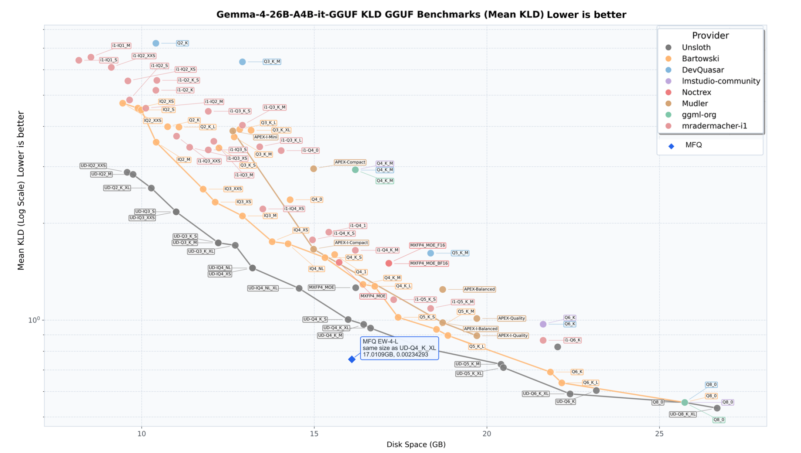
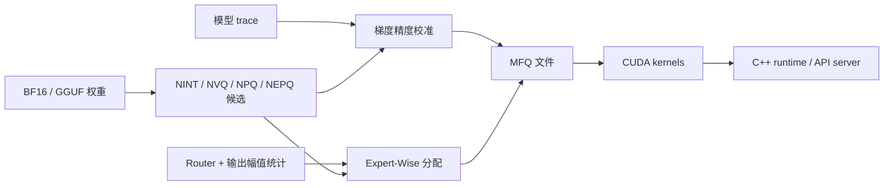

<div align="center">

# TyloQuant MFQ — 基准测试与技术说明


**Neuron-anchored mixed-format quantization and high-fidelity LLM inference**

**Every Bit. Maximum Fidelity.**

NINT · NVQ/NPQ · NEPQ · Gradient Precision Calibration · Expert-Wise MoE · CUDA/C++ Runtime

</div>

<p align="center">
  <a href="../README.zh-CN.md">项目主页</a> ·
  <a href="./benchmarks.md">English</a> | <strong>中文</strong>
</p>

本文集中收录 TyloQuant MFQ 的质量、码率与运行性能数据。项目主页仅展示一项最明确的
核心结果；历史测试与探索性数据统一保留在这里，便于查阅。

## Gemma 核心结果



在与 `UD-Q4_K_XL` 相同的 `17.0109 GB` 文件大小下，**MFQ EW-4-L** 的 Mean KLD 为
`0.00234293`，匹配大小基线为 `0.00424385`，即 **Mean KLD 降低 44.79%**；
该指标越低越好。

| 模型 | 方案 | 文件大小 | Mean KLD |
|---|---|---:|---:|
| Gemma-4-26B-A4B-it | MFQ EW-4-L | `17.0109 GB` | **`0.00234293`** |
| Gemma-4-26B-A4B-it | UD-Q4_K_XL | `17.0109 GB` | `0.00424385` |

上图将这一等大小结果放在更完整的 GGUF 量化对比中。后续章节保留项目的完整测试数据及其
适用范围说明。

**TyloQuant MFQ**（简称 **MFQ**）是一个联合设计量化格式、精度分配和推理 kernel 的研究型
LLM 推理项目。它以 **Every Bit. Maximum Fidelity.** 为目标，覆盖
`0.84-8.30 bpw` 的自定义权重编码，可按计算组或 MoE 专家分配精度，并由 CUDA kernel 与
C++ runtime 直接执行 packed 权重。

## 核心设计

| 层次 | 设计 | 解决的问题 |
|---|---|---|
| 权重格式 | NINT、NVQ、NPQ、NEPQ | 在 8 bit 到 1 bit 以下提供连续质量档 |
| Dense 精度分配 | 梯度精度校准 | 用模型输出分布选择逐计算组精度 |
| MoE 精度分配 | Expert-Wise Precision | 把码率集中到期望输出贡献更大的专家 |
| 专家容器 | NINTM v2 | 在同一 MoE tensor 中保存和执行异构格式 |
| 推理系统 | CUDA kernel + C++ runtime | 避免部署时展开完整 FP16 权重 |



## NINT

NINT（Neuron INT）为每个输出神经元保存一组 FP16 顶层 scale/min，短 group 只保存低位相对
sub-scale/sub-min：

```text
w[j, i] ~= d_neuron[j] * local_scale[j, g] * q[j, i]
           - dmin_neuron[j] * local_min[j, g]

bpw = bits + 32 / input_width + 2 * sub_bits / groupsize
```

| 格式 | Profile `(bits, gs, sub_bits)` | K=5120 bpw |
|---|---:|---:|
| NINT4 | `(4, 24, 6)` | `4.5063` |
| NINT5 | `(5, 28, 7)` | `5.5063` |
| NINT6 | `(6, 24, 7)` | `6.5896` |
| NINT8 | `(8, 48, 7)` | `8.2979` |

### 相比 K-quant

llama.cpp 的 K-quant 以 256 个权重为 super-block，再以 32 个权重为 sub-block。NINT 将顶层
scale/min 延伸到整条输出神经元权重行，把省下的元数据预算用于更短的局部 group。

| 4-bit 预算 | 整数值 | 顶层 scale/min | 局部元数据 | 总计 |
|---|---:|---:|---:|---:|
| Q4_K | `4.000` | `32 / 256 = 0.125` | `12 / 32 = 0.375` | `4.500 bpw` |
| NINT4，K=5120 | `4.000` | `32 / 5120 = 0.00625` | `12 / 24 = 0.500` | `4.50625 bpw` |

相近码率下，NINT4 的局部仿射 group 从 32 缩短到 24，group 数量增加约 `33%`。CUDA kernel
将 K24 表示为 `16+8` 或三个 8-value 向量，并临时映射到 K32 MMA fragment；模型文件和常驻权重
没有 padding。

Qwen3.6-27B 真实全矩阵结果：

| 格式 | MFQ | llama.cpp 对照 | SNR 变化 |
|---|---:|---:|---:|
| NINT4 | `4.506 bpw / 23.43 dB` | Q4_K `4.500 / 22.86 dB` | `+0.57 dB` |
| NINT5 | `5.506 bpw / 29.26 dB` | Q5_K `5.500 / 28.78 dB` | `+0.48 dB` |
| NINT6 `gs26` Pareto 点 | `6.545 bpw / 35.06 dB` | Q6_K `6.562 / 34.94 dB` | `+0.12 dB` |
| NINT8 | `8.298 bpw / 43.65 dB` | Q8_K `9.125 / 43.02 dB` | `+0.63 dB` |

NINT8 在五个全矩阵上的平均 SNR 比 Q8_K 高 `0.79 dB`，同时少用 `0.827 bpw`。

## NVQ、NPQ 与 NEPQ

低于 4 bit 后，标量整数的幅度等级过少。MFQ 用短向量 index 表示方向，用 neuron anchor 和
group state 表示行级及局部幅度。

| 家族 | 码率范围 | 表示 |
|---|---:|---|
| NVQ3 / NVQ3J | `~3.046 bpw` | D4/4D 格点向量与联合 shape/scale state |
| NVQ2 / NVQ2J | `~2.046 bpw` | E8/8D 格点向量与 parity sign |
| NVQ1-L / NVQ1-S | `~1.34-1.56 bpw` | 8D ternary 向量 |
| NPQ0-L / NPQ0-S | `~0.84-1.00 bpw` | state-conditioned PQ3+4 / PQ3+3 |
| NEPQ0/1 | `~0.92-1.63 bpw` | 跨专家 256-bank 码本池 |

NVQ2 的 8 个 int8 坐标可由两次 `__dp4a` 消费；NVQ3 的 4D 码字提供更细的局部选择。
NVQ2J/NVQ3J 让原有 group state 同时选择幅度和 shape bank，几乎不增加主位流。NPQ0 将
8D 向量分成两个 4D 子向量，把约 1 bit 区间的码本成本压到可部署范围。

NEPQ 面向 MoE。四个连续 gs24 group 组成一个 96-weight super-group，共享一个 uint8 bank ID；
kernel 只访问当前 active expert 的 selector、码本和权重流。

完整定义和 16 种正式编码见 [FORMATS.md](../FORMATS.md)。

### 代表性结果

Qwen3.5-9B 的 10 个真实矩阵，每矩阵抽取 256 行：

| 格式 | bpw | 平均 SNR | 平均 NMSE |
|---|---:|---:|---:|
| NVQ2 | `2.0450` | `9.620 dB` | `10.9169%` |
| IQ2_XXS | `2.0625` | `9.132 dB` | `12.2142%` |
| JANGTQ2 + RHT | `2.0031` | `9.296 dB` | `11.7595%` |
| NVQ3 | `3.0450` | `14.996 dB` | `3.1654%` |
| IQ3_XXS | `3.0625` | `13.225 dB` | `4.7608%` |
| JANGTQ3 + RHT | `3.2055` | `14.591 dB` | `3.4750%` |

同一 Qwen3.5-9B UD IQ2_XXS recipe、16,368 个评分 token：

| 模型 | 文件大小 | KLD/BF16 CE | Same-top |
|---|---:|---:|---:|
| UD IQ2_XXS | `3,190,613,216 B` | `20.7271%` | `74.3040%` |
| NVQ2J + imatrix + neuron gain | `3,080,509,395 B` | `17.5493%` | `76.0753%` |

NVQ2J 文件小 `3.45%`，KLD 相对降低 `15.33%`。

## 梯度精度校准

固定 recipe 只按 tensor role 或层区间分配精度。MFQ 在完整计算图中把每个计算组的候选格式
松弛为可微概率：

```text
p[g,c] = softmax(alpha[g,c] / temperature)
y[g]   = sum_c p[g,c] * Linear(Quantize_c(W[g]), x)

loss = KL(BF16 teacher || relaxed MFQ) + storage_constraint
```

训练只更新精度 logits `alpha`。候选权重保持固定，最终由 multiple-choice MILP 按真实 blob
字节数生成硬方案。计算组遵守 runtime 的融合约束：Full Attention 的 Q/K 同精度，Linear
Attention 的 Q/K 同精度，FFN 的 gate/up 同精度，V、Z、O 和 down 可独立选择。

Qwen3.5-9B 使用目标模型自生成 trace：157 万 soft-train token、26 万 hard-train token、
26 万 validation token，共 184 个决策组和 736 个候选。

| 独立评测集 | 评分 token | UD Q4_K_M | 固定 UD-recipe MFQ | 梯度校准 MFQ |
|---|---:|---:|---:|---:|
| WikiText | `16,368` | `1.98752%` | `1.51213%` | `1.10104%` |
| Assistant thinking | `17,603` | `2.55163%` | `3.53614%` | `2.69735%` |
| Assistant direct | `16,614` | `3.10724%` | `3.98939%` | `2.70948%` |
| Assistant combined | `34,217` | `2.81590%` | `3.75172%` | `2.70312%` |

表中指标为 `D_KL(P_ref || P_quant) / BF16 CE`。该梯度方案完成了 prefill/KLD 评估；对应旧工件
曾因当时的通用 NINT8 M=1 GEMV 数值问题未通过 decode 验收。kernel 已修正，当前版本仍需重新生成
完整的生产 decode 验收工件。

## Expert-Wise Precision

EW 为每个 routed expert 独立选择精度。gate/up 保持同精度以使用融合投影，down 独立选择。
分配依据同时包含路由频率、router 权重和专家输出范数：

```text
exposure(layer, expert)
    = E[1_selected * router_weight * ||expert_output||_2]

distortion(profile)
    = normalized_exposure * NMSE(weight, quantized_weight)
```

MILP 在模型总字节预算下最小化所有专家的期望失真。高 exposure 专家获得更高精度，使实际被
路由访问的平均 bpw 高于模型文件的存储平均 bpw：

| 模型 | 存储平均 expert bpw | 路由命中平均 bpw | 增幅 |
|---|---:|---:|---:|
| Qwen3.6-35B-A3B | `4.83852` | `5.06115` | `4.60%` |
| Gemma4-26B-A4B | `5.07146` | `5.87634` | `15.87%` |

### 整模结果

以下历史对比使用 `MeanKLD = mean D_KL(P_ref || P_quant)`；百分比为 `MeanKLD / BF16 CE`。

| 模型 | 方案 | 总 bpw | MeanKLD | KLD/BF16 CE | Same-top |
|---|---|---:|---:|---:|---:|
| Qwen3.6-35B-A3B | UD Q4_K_M | `4.89221312` | `0.01184600` | `2.99225%` | `97.1951%` |
| Qwen3.6-35B-A3B | EW-MFQ | `4.89219661` | `0.00941682` | `2.37865%` | `97.6345%` |
| Gemma4-26B-A4B | UD Q4_K_XL | `5.39321835` | `0.00424385` | `0.57234%` | `98.7045%` |
| Gemma4-26B-A4B | EW-MFQ | `5.39318548` | `0.00233969` | `0.31554%` | `98.9025%` |
| Gemma4-26B-A4B | UD Q5_K_M | `6.70558280` | `0.00222703` | `0.30035%` | `99.0949%` |
| Gemma4-26B-A4B | UD Q5_K_XL | `6.72695272` | `0.00220262` | `0.29705%` | `99.0949%` |

Gemma EW-MFQ 比 Q5_K_XL 少用 `19.83%` 总 bpw，MeanKLD 高 `6.22%`，Same-top 低
`0.1924` 个百分点。

### DeepSeek-V4-Flash 压力测试

`DeepSeek-V4-Flash-EW88G-NVQ2J-NINT4.mfq` 是当前最大的 mixed-family EW 工件：

| 项目 | 数值 |
|---|---:|
| 文件大小 | `87,994,061,055 B` |
| 受跟踪权重平均码率 | `2.34048 bpw` |
| Tensor 数 | `1,285` |
| Routed expert 选择数 | `22,016` |
| NVQ2J / NINT4 | `20,001 / 2,015` |
| gate/up 的 NINT4 占比 / 覆盖 exposure | `17.25% / 54.20%` |
| down 的 NINT4 占比 / 覆盖 exposure | `1.05% / 90.89%` |

少量 NINT4 选择覆盖了不成比例的期望输出能量，体现了 EW 在尖锐路由分布上的码率集中效果。
工件已通过结构、mmap 和抽样解码校验；对官方参考模型的独立整模 MeanKLD 仍待完成。

## NINTM 与 CUDA Kernel

NINTM v2 将相同 `family + profile + codebook + rotation` 的专家聚成同质 cohort，并保存两张
GPU 映射表：

```text
expert_pool[global_expert]  -> precision cohort
expert_local[global_expert] -> expert 在 cohort 内的连续行区间
```

权重保持原生 packed payload。router 在 GPU 上 compact token-route；输入激活按兼容布局量化并
复用；各 cohort 直接调用 NINT、NVQ、NPQ 或 NEPQ grouped kernel。gate/up kernel 内生成
SwiGLU/GeGLU，down 乘 FP32 route weight 后归并回 token 顺序。

| 范围 | 实现 |
|---|---|
| Decode | packed q8-activation DP4A GEMV、multi-warp NVQ、异构 expert GEMV |
| 小 M | batched GEMV、INT8 MMA、tile-dequant MMQ、grouped MoE MMQ |
| 大 M | vectorized dequant + cuBLAS、route-compacted grouped MMQ |
| Attention | FP16 KV、FlashAttention prefill、split-K decode、partial/proportional RoPE、SWA |
| Linear Attention | GDN、conv state、alpha/beta、state update |
| DeepSeek V4 | HCA/CSA/mHC、sqrt-softplus router、精确 HC 路径 |
| Runtime | mmap/streaming loader、CUDA Graph、GPU sampling、OpenAI HTTP/SSE |

大二维权重以 packed 形式常驻 GPU，部署时不物化完整 FP16 模型。

## 性能

| GPU | 模型与任务 | MFQ | llama.cpp | MFQ / llama.cpp |
|---|---|---:|---:|---:|
| RTX 3090 Ti | Qwen3.5-9B，M=2048 prefill | `5,099 tok/s` | `4,752 tok/s` | `107.3%` |
| RTX 3090 Ti | Qwen3.6-35B-A3B EW decode | `140.06 tok/s` | `175.11 tok/s` | `79.98%` |
| RTX 3090 Ti | Gemma4-26B-A4B EW decode | `127.14 tok/s` | `142.61 tok/s` | `89.15%` |
| RTX PRO 6000 Blackwell | DeepSeek-V4-Flash EW decode | `49.059 tok/s` | `67.692 tok/s` | `72.47%` |

DeepSeek-V4-Flash 的 MFQ 数据使用 87.994 GB EW 工件和 production CUDA Graph；llama.cpp 数据
使用 86.896 GB UD IQ1_M。两者文件大小接近，精度质量尚未完成对位 KLD，因此该行只比较运行速度。

## 支持范围

| 能力 | 状态 |
|---|---|
| Qwen3.5 full attention + linear attention/GDN | 可用 |
| Qwen3.6 routed MoE | 可用 |
| Gemma4 GeGLU + SWA + routed MoE | 可用 |
| DeepSeek-V4-Flash HCA/CSA/mHC + MoE | 可用，独立整模 KLD 待测 |
| NINT/NVQ/NPQ/NEPQ 16 种编码 | 文件、量化、CUDA、C++ 可用 |
| NINTM v2 mixed-family | HF/GGUF 流式转换、mmap、grouped runtime 可用 |
| OpenAI chat/completions + SSE | 可用 |
| MTP speculative graph | 待接入 |
| Continuous batching / prefix cache / multi-GPU | 待接入 |
| Vision input / tool calls | 待实现 |
| Metal | packed GEMV/MMQ、在线/临时反量化 large-M GEMM、NINT/VQ-family 融合、Attention/KV cache、expert-owned grouped MoE MMA、融合 SSM/GDN、GLM DSA/sparse MLA、DeepSeek-V4 sparse/indexer/HC kernel 与 Qwen3.5 混合 CausalLM 可用；模型专用服务接入待实现 |

## 快速开始

安装 Python 工具：

```powershell
python -m pip install -e ".[train,calibration]"
```

查看量化与校准入口：

```powershell
python -m mfq.tools.quantize_hf_to_mfq --help
python -m mfq.tools.quantize_gguf_to_mfq --help
mfq calibrate --help
```

构建 C++ runtime：

```powershell
cmake -S cpp_runtime -B build/cpp_runtime -G Ninja -DCMAKE_BUILD_TYPE=Release
cmake --build build/cpp_runtime -j 8
```

启动服务：

```powershell
build/cpp_runtime/mfq-decode.exe `
  --mfq path/to/model.mfq `
  --config path/to/config.json `
  --server `
  --tokenizer-model path/to/tokenizer.gguf `
  --model-name mfq-model `
  --ctx-size 32768 `
  --port 8080
```

API 与服务参数见 [C++ runtime README](../cpp_runtime/README.md)。

## 文档与数据

- [量化格式总览](../FORMATS.md)
- [C++ runtime](../cpp_runtime/README.md)
- [MoE Observation 数据索引](../plan/MoE公开Observation数据索引.md)
- [0xSero 公开资源索引](../plan/0xSero公开资源索引.md)

TyloQuant MFQ 当前是单 GPU CUDA 研究原型，server 按单模型串行处理请求。

许可证：[Apache License 2.0](../LICENSE)。
